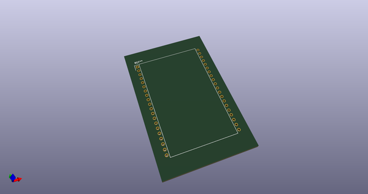
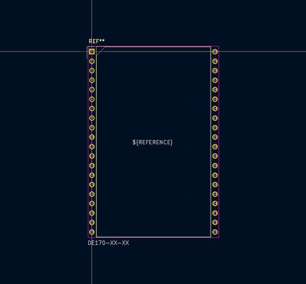
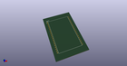
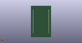
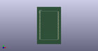

# OOMP Footprint  
## DE170-XX-XX  by none  
  
oomp key: oomp_kicad_display_7segment_de170_xx_xx  
  
source repo at: [http://gitlab.com/kicad/kicad-footprints/blob/master/tmp/data//oomlout_oomp_footprint_src/Varistor.pretty/RV_Rect_V25S440P_L26.5mm_W8.2mm_P12.7mm.kicad_mod](http://gitlab.com/kicad/kicad-footprints/blob/master/tmp/data//oomlout_oomp_footprint_src/Varistor.pretty/RV_Rect_V25S440P_L26.5mm_W8.2mm_P12.7mm.kicad_mod)  
## Footprint  
  
  
  
  
| name | value | 
| --- | --- | 
| footprint name | DE170-XX-XX | 
| footprint description | http://www.display-elektronik.de/filter/DE170-RS-20_75.pdf | 
| number of pads | 40 | 
| github path | http://github.com/kicad/kicad-footprints/blob/master/tmp/data//oomlout_oomp_footprint_src/Display_7Segment.pretty/DE170-XX-XX.kicad_mod | 
| oomp key | oomp_kicad_display_7segment_de170_xx_xx | 
| oomp bot github | https://github.com/oomlout/oomlout_oomp_footprint_bot/tree/main/tmp/data//oomlout_oomp_footprint_src/footprints/kicad_display_7segment_de170_xx_xx/working | 
## Images  
  
  
  
  
  
  
  
  
