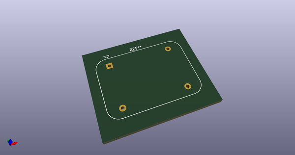
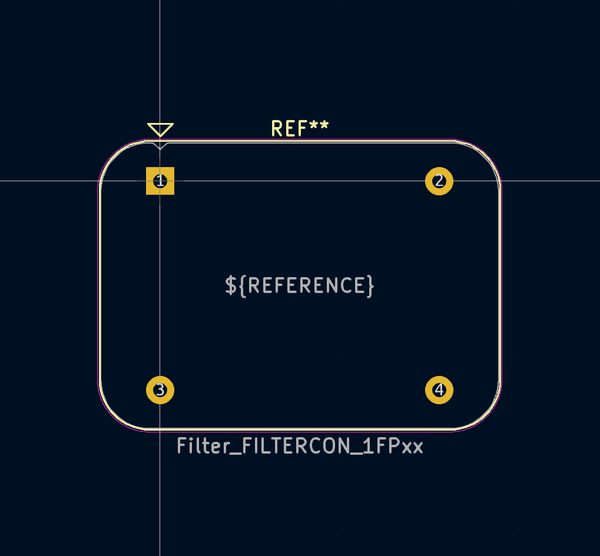
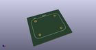
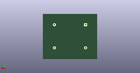
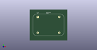

# OOMP Footprint  
## Filter_FILTERCON_1FPxx  by none  
  
oomp key: oomp_kicad_filter_filter_filtercon_1fpxx  
  
source repo at: [http://gitlab.com/kicad/kicad-footprints/blob/master/tmp/data//oomlout_oomp_footprint_src/Varistor.pretty/RV_Rect_V25S440P_L26.5mm_W8.2mm_P12.7mm.kicad_mod](http://gitlab.com/kicad/kicad-footprints/blob/master/tmp/data//oomlout_oomp_footprint_src/Varistor.pretty/RV_Rect_V25S440P_L26.5mm_W8.2mm_P12.7mm.kicad_mod)  
## Footprint  
  
  
  
  
| name | value | 
| --- | --- | 
| footprint name | Filter_FILTERCON_1FPxx | 
| footprint description | 0.5A, 250VAC, 50/60Hz line filter (https://filtercon.com.pl/wp-content/uploads/2019/07/Karta-katalogowa-FP-12-1.pdf) | 
| number of pads | 4 | 
| github path | http://github.com/kicad/kicad-footprints/blob/master/tmp/data//oomlout_oomp_footprint_src/Filter.pretty/Filter_FILTERCON_1FPxx.kicad_mod | 
| oomp key | oomp_kicad_filter_filter_filtercon_1fpxx | 
| oomp bot github | https://github.com/oomlout/oomlout_oomp_footprint_bot/tree/main/tmp/data//oomlout_oomp_footprint_src/footprints/kicad_filter_filter_filtercon_1fpxx/working | 
## Images  
  
  
  
  
  
  
  
  
