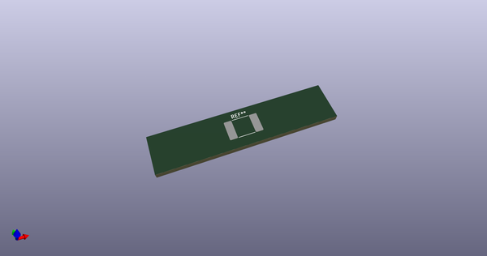
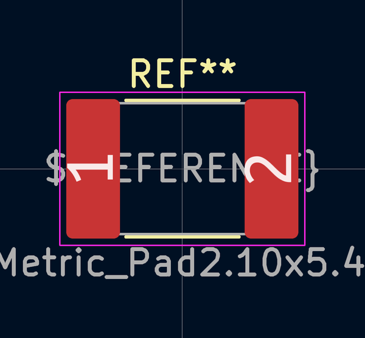
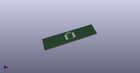

# OOMP Footprint  
## Fuse_2920_7451Metric_Pad2.10x5.45mm_HandSolder  by none  
  
oomp key: oomp_kicad_fuse_fuse_2920_7451metric_pad2_10x5_45mm_handsolder  
  
source repo at: [http://gitlab.com/kicad/kicad-footprints/blob/master/tmp/data//oomlout_oomp_footprint_src/Varistor.pretty/RV_Rect_V25S440P_L26.5mm_W8.2mm_P12.7mm.kicad_mod](http://gitlab.com/kicad/kicad-footprints/blob/master/tmp/data//oomlout_oomp_footprint_src/Varistor.pretty/RV_Rect_V25S440P_L26.5mm_W8.2mm_P12.7mm.kicad_mod)  
## Footprint  
  
  
  
  
| name | value | 
| --- | --- | 
| footprint name | Fuse_2920_7451Metric_Pad2.10x5.45mm_HandSolder | 
| footprint description | Fuse SMD 2920 (7451 Metric), square (rectangular) end terminal, IPC_7351 nominal with elongated pad for handsoldering. (Body size from: http://www.megastar.com/products/fusetronic/polyswitch/PDF/smd2920.pdf), generated with kicad-footprint-generator | 
| number of pads | 2 | 
| github path | http://github.com/kicad/kicad-footprints/blob/master/tmp/data//oomlout_oomp_footprint_src/Fuse.pretty/Fuse_2920_7451Metric_Pad2.10x5.45mm_HandSolder.kicad_mod | 
| oomp key | oomp_kicad_fuse_fuse_2920_7451metric_pad2_10x5_45mm_handsolder | 
| oomp bot github | https://github.com/oomlout/oomlout_oomp_footprint_bot/tree/main/tmp/data//oomlout_oomp_footprint_src/footprints/kicad_fuse_fuse_2920_7451metric_pad2_10x5_45mm_handsolder/working | 
## Images  
  
  
  
  
  
  
  
  
