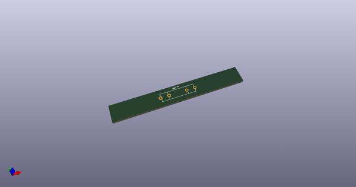
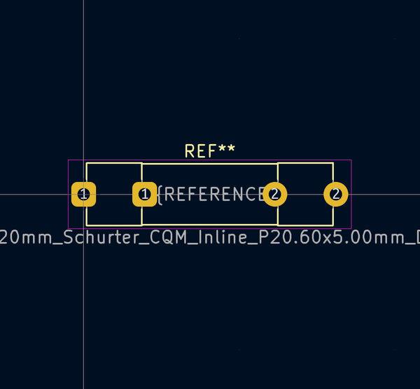
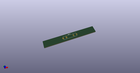

# OOMP Footprint  
## Fuseholder_Clip-5x20mm_Schurter_CQM_Inline_P20.60x5.00mm_D1.00mm_Horizontal  by none  
  
oomp key: oomp_kicad_fuse_fuseholder_clip_5x20mm_schurter_cqm_inline_p20_60x5_00mm_d1_00mm_horizontal  
  
source repo at: [http://gitlab.com/kicad/kicad-footprints/blob/master/tmp/data//oomlout_oomp_footprint_src/Varistor.pretty/RV_Rect_V25S440P_L26.5mm_W8.2mm_P12.7mm.kicad_mod](http://gitlab.com/kicad/kicad-footprints/blob/master/tmp/data//oomlout_oomp_footprint_src/Varistor.pretty/RV_Rect_V25S440P_L26.5mm_W8.2mm_P12.7mm.kicad_mod)  
## Footprint  
  
  
  
  
| name | value | 
| --- | --- | 
| footprint name | Fuseholder_Clip-5x20mm_Schurter_CQM_Inline_P20.60x5.00mm_D1.00mm_Horizontal | 
| footprint description | Fuseholder Clips, 5x20mm Cylinder Fuse, Pins Inline, Horizontal, Schurter CQM (0752), https://www.schurter.com/en/datasheet/typ_CQM.pdf | 
| number of pads | 4 | 
| github path | http://github.com/kicad/kicad-footprints/blob/master/tmp/data//oomlout_oomp_footprint_src/Fuse.pretty/Fuseholder_Clip-5x20mm_Schurter_CQM_Inline_P20.60x5.00mm_D1.00mm_Horizontal.kicad_mod | 
| oomp key | oomp_kicad_fuse_fuseholder_clip_5x20mm_schurter_cqm_inline_p20_60x5_00mm_d1_00mm_horizontal | 
| oomp bot github | https://github.com/oomlout/oomlout_oomp_footprint_bot/tree/main/tmp/data//oomlout_oomp_footprint_src/footprints/kicad_fuse_fuseholder_clip_5x20mm_schurter_cqm_inline_p20_60x5_00mm_d1_00mm_horizontal/working | 
## Images  
  
  
  
  
  
  
  
  
