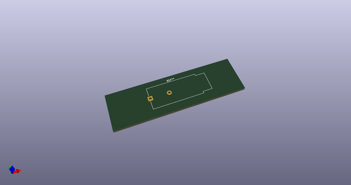
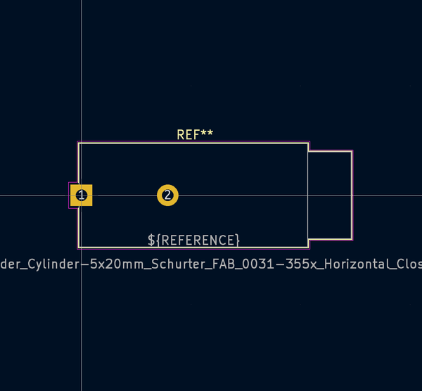
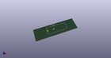

# OOMP Footprint  
## Fuseholder_Cylinder-5x20mm_Schurter_FAB_0031-355x_Horizontal_Closed  by none  
  
oomp key: oomp_kicad_fuse_fuseholder_cylinder_5x20mm_schurter_fab_0031_355x_horizontal_closed  
  
source repo at: [http://gitlab.com/kicad/kicad-footprints/blob/master/tmp/data//oomlout_oomp_footprint_src/Varistor.pretty/RV_Rect_V25S440P_L26.5mm_W8.2mm_P12.7mm.kicad_mod](http://gitlab.com/kicad/kicad-footprints/blob/master/tmp/data//oomlout_oomp_footprint_src/Varistor.pretty/RV_Rect_V25S440P_L26.5mm_W8.2mm_P12.7mm.kicad_mod)  
## Footprint  
  
  
  
  
| name | value | 
| --- | --- | 
| footprint name | Fuseholder_Cylinder-5x20mm_Schurter_FAB_0031-355x_Horizontal_Closed | 
| footprint description | Fuseholder 5x20mm horizontal Shurter model FAB, Suitable for order numbers 0031.3551 and 0031.3558  (https://www.schurter.com/bundles/snceschurter/epim/_ProdPool_/newDS/en/typ_FAB.pdf) | 
| number of pads | 2 | 
| github path | http://github.com/kicad/kicad-footprints/blob/master/tmp/data//oomlout_oomp_footprint_src/Fuse.pretty/Fuseholder_Cylinder-5x20mm_Schurter_FAB_0031-355x_Horizontal_Closed.kicad_mod | 
| oomp key | oomp_kicad_fuse_fuseholder_cylinder_5x20mm_schurter_fab_0031_355x_horizontal_closed | 
| oomp bot github | https://github.com/oomlout/oomlout_oomp_footprint_bot/tree/main/tmp/data//oomlout_oomp_footprint_src/footprints/kicad_fuse_fuseholder_cylinder_5x20mm_schurter_fab_0031_355x_horizontal_closed/working | 
## Images  
  
  
  
  
  
  
  
  
