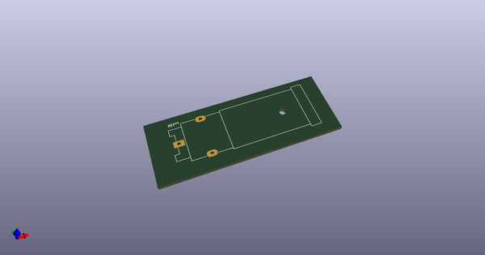
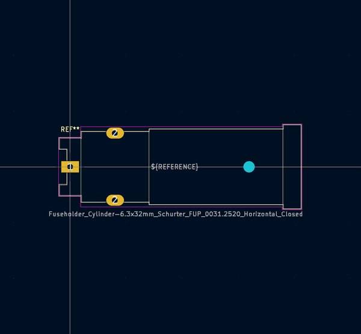
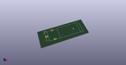
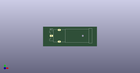

# OOMP Footprint  
## Fuseholder_Cylinder-6.3x32mm_Schurter_FUP_0031.2520_Horizontal_Closed  by none  
  
oomp key: oomp_kicad_fuse_fuseholder_cylinder_6_3x32mm_schurter_fup_0031_2520_horizontal_closed  
  
source repo at: [http://gitlab.com/kicad/kicad-footprints/blob/master/tmp/data//oomlout_oomp_footprint_src/Varistor.pretty/RV_Rect_V25S440P_L26.5mm_W8.2mm_P12.7mm.kicad_mod](http://gitlab.com/kicad/kicad-footprints/blob/master/tmp/data//oomlout_oomp_footprint_src/Varistor.pretty/RV_Rect_V25S440P_L26.5mm_W8.2mm_P12.7mm.kicad_mod)  
## Footprint  
  
  
  
  
| name | value | 
| --- | --- | 
| footprint name | Fuseholder_Cylinder-6.3x32mm_Schurter_FUP_0031.2520_Horizontal_Closed | 
| footprint description | Shock-Safe closed Fuseholder, Schurter FUP Series, 6.3 x 32 mm, Slotted Cap, horizontal, 500 VAC 4W/16A (VDE), 600V 30A (UL/CSA), order numbers: 0031.2520 (0031.2500 + 0031.2321), http://www.schurter.ch/bundles/snceschurter/epim/_ProdPool_/newDS/en/typ_FUP.pdf | 
| number of pads | 4 | 
| github path | http://github.com/kicad/kicad-footprints/blob/master/tmp/data//oomlout_oomp_footprint_src/Fuse.pretty/Fuseholder_Cylinder-6.3x32mm_Schurter_FUP_0031.2520_Horizontal_Closed.kicad_mod | 
| oomp key | oomp_kicad_fuse_fuseholder_cylinder_6_3x32mm_schurter_fup_0031_2520_horizontal_closed | 
| oomp bot github | https://github.com/oomlout/oomlout_oomp_footprint_bot/tree/main/tmp/data//oomlout_oomp_footprint_src/footprints/kicad_fuse_fuseholder_cylinder_6_3x32mm_schurter_fup_0031_2520_horizontal_closed/working | 
## Images  
  
  
  
  
  
  
  
  
