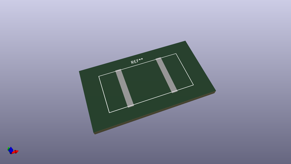
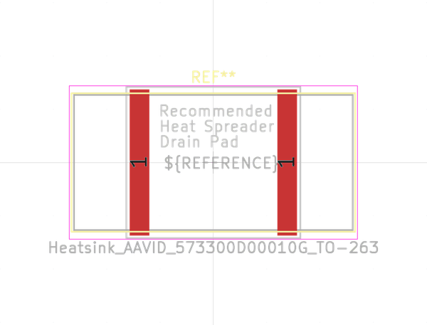
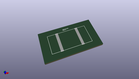

# OOMP Footprint  
## Heatsink_AAVID_573300D00010G_TO-263  by none  
  
oomp key: oomp_kicad_heatsink_heatsink_aavid_573300d00010g_to_263  
  
source repo at: [http://gitlab.com/kicad/kicad-footprints/blob/master/tmp/data//oomlout_oomp_footprint_src/Varistor.pretty/RV_Rect_V25S440P_L26.5mm_W8.2mm_P12.7mm.kicad_mod](http://gitlab.com/kicad/kicad-footprints/blob/master/tmp/data//oomlout_oomp_footprint_src/Varistor.pretty/RV_Rect_V25S440P_L26.5mm_W8.2mm_P12.7mm.kicad_mod)  
## Footprint  
  
  
  
  
| name | value | 
| --- | --- | 
| footprint name | Heatsink_AAVID_573300D00010G_TO-263 | 
| footprint description | Heatsink, 12.70mm x 26.16mm x 10.16, SMD, 18K/W, TO-263, D2 Pak, https://www.shopaavid.com/Product/573300D00000G | 
| number of pads | 2 | 
| github path | http://github.com/kicad/kicad-footprints/blob/master/tmp/data//oomlout_oomp_footprint_src/Heatsink.pretty/Heatsink_AAVID_573300D00010G_TO-263.kicad_mod | 
| oomp key | oomp_kicad_heatsink_heatsink_aavid_573300d00010g_to_263 | 
| oomp bot github | https://github.com/oomlout/oomlout_oomp_footprint_bot/tree/main/tmp/data//oomlout_oomp_footprint_src/footprints/kicad_heatsink_heatsink_aavid_573300d00010g_to_263/working | 
## Images  
  
  
  
  
  
  
