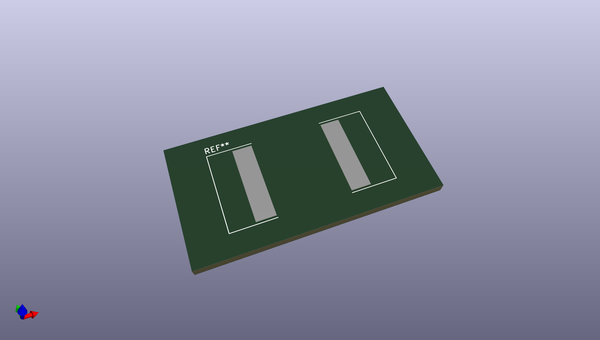
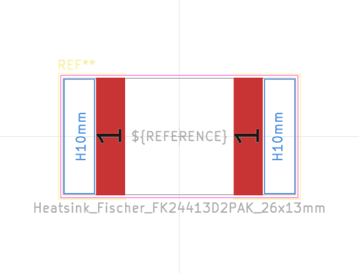
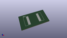
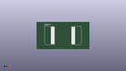

# OOMP Footprint  
## Heatsink_Fischer_FK24413D2PAK_26x13mm  by none  
  
oomp key: oomp_kicad_heatsink_heatsink_fischer_fk24413d2pak_26x13mm  
  
source repo at: [http://gitlab.com/kicad/kicad-footprints/blob/master/tmp/data//oomlout_oomp_footprint_src/Varistor.pretty/RV_Rect_V25S440P_L26.5mm_W8.2mm_P12.7mm.kicad_mod](http://gitlab.com/kicad/kicad-footprints/blob/master/tmp/data//oomlout_oomp_footprint_src/Varistor.pretty/RV_Rect_V25S440P_L26.5mm_W8.2mm_P12.7mm.kicad_mod)  
## Footprint  
  
  
  
  
| name | value | 
| --- | --- | 
| footprint name | Heatsink_Fischer_FK24413D2PAK_26x13mm | 
| footprint description | 26x13 mm SMD heatsink for TO-252 TO-263 TO-268, https://www.fischerelektronik.de/pim/upload/fischerData/cadpdf/base/fk_244_13_d2_pak.pdf | 
| number of pads | 2 | 
| github path | http://github.com/kicad/kicad-footprints/blob/master/tmp/data//oomlout_oomp_footprint_src/Heatsink.pretty/Heatsink_Fischer_FK24413D2PAK_26x13mm.kicad_mod | 
| oomp key | oomp_kicad_heatsink_heatsink_fischer_fk24413d2pak_26x13mm | 
| oomp bot github | https://github.com/oomlout/oomlout_oomp_footprint_bot/tree/main/tmp/data//oomlout_oomp_footprint_src/footprints/kicad_heatsink_heatsink_fischer_fk24413d2pak_26x13mm/working | 
## Images  
  
  
  
  
  
  
  
  
