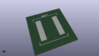

# OOMP Footprint  
## L_Coilcraft_XAL1513-153  by none  
  
oomp key: oomp_kicad_inductor_smd_l_coilcraft_xal1513_153  
  
source repo at: [http://gitlab.com/kicad/kicad-footprints/blob/master/tmp/data//oomlout_oomp_footprint_src/Varistor.pretty/RV_Rect_V25S440P_L26.5mm_W8.2mm_P12.7mm.kicad_mod](http://gitlab.com/kicad/kicad-footprints/blob/master/tmp/data//oomlout_oomp_footprint_src/Varistor.pretty/RV_Rect_V25S440P_L26.5mm_W8.2mm_P12.7mm.kicad_mod)  
## Footprint  
  
  
  
  
| name | value | 
| --- | --- | 
| footprint name | L_Coilcraft_XAL1513-153 | 
| footprint description | Inductor, Coilcraft, XAL1513-153, 15.4x16.4x13.0mm, https://www.coilcraft.com/getmedia/129ad6f3-0445-47fd-a0b3-edeb49177c17/xal1513.pdf | 
| number of pads | 2 | 
| github path | http://github.com/kicad/kicad-footprints/blob/master/tmp/data//oomlout_oomp_footprint_src/Inductor_SMD.pretty/L_Coilcraft_XAL1513-153.kicad_mod | 
| oomp key | oomp_kicad_inductor_smd_l_coilcraft_xal1513_153 | 
| oomp bot github | https://github.com/oomlout/oomlout_oomp_footprint_bot/tree/main/tmp/data//oomlout_oomp_footprint_src/footprints/kicad_inductor_smd_l_coilcraft_xal1513_153/working | 
## Images  
  
  
  
  
  
  
