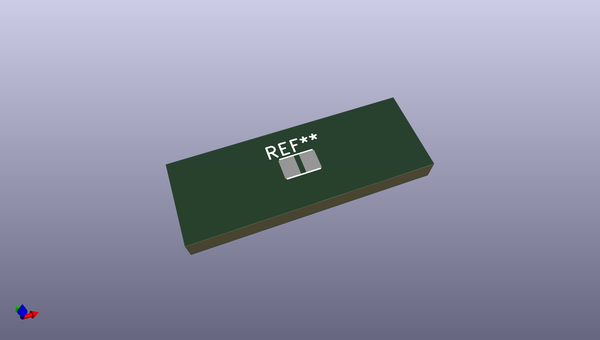
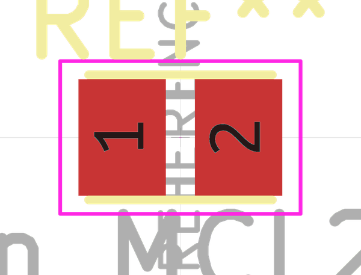
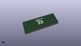

# OOMP Footprint  
## L_Eaton_MCL2012V1  by none  
  
oomp key: oomp_kicad_inductor_smd_l_eaton_mcl2012v1  
  
source repo at: [http://gitlab.com/kicad/kicad-footprints/blob/master/tmp/data//oomlout_oomp_footprint_src/Varistor.pretty/RV_Rect_V25S440P_L26.5mm_W8.2mm_P12.7mm.kicad_mod](http://gitlab.com/kicad/kicad-footprints/blob/master/tmp/data//oomlout_oomp_footprint_src/Varistor.pretty/RV_Rect_V25S440P_L26.5mm_W8.2mm_P12.7mm.kicad_mod)  
## Footprint  
  
  
  
  
| name | value | 
| --- | --- | 
| footprint name | L_Eaton_MCL2012V1 | 
| footprint description | Inductor, Eaton, MCL2012V1, 2.0x1.2x0.9mm, https://eu.mouser.com/datasheet/2/87/eaton-mcl2012v1-multilayer-chip-inductor-data-shee-1622891.pdf | 
| number of pads | 2 | 
| github path | http://github.com/kicad/kicad-footprints/blob/master/tmp/data//oomlout_oomp_footprint_src/Inductor_SMD.pretty/L_Eaton_MCL2012V1.kicad_mod | 
| oomp key | oomp_kicad_inductor_smd_l_eaton_mcl2012v1 | 
| oomp bot github | https://github.com/oomlout/oomlout_oomp_footprint_bot/tree/main/tmp/data//oomlout_oomp_footprint_src/footprints/kicad_inductor_smd_l_eaton_mcl2012v1/working | 
## Images  
  
  
  
  
  
  
  
  
