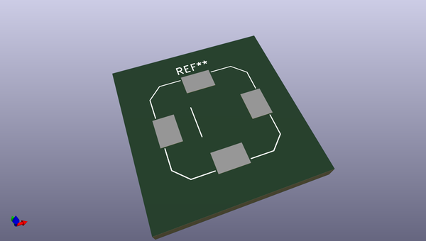
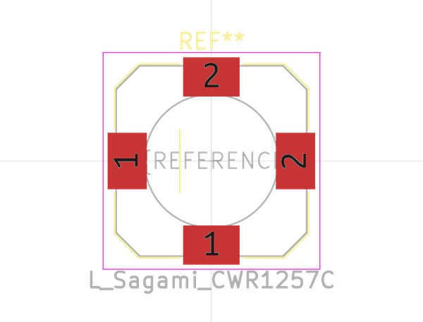
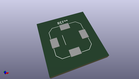
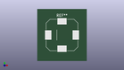

# OOMP Footprint  
## L_Sagami_CWR1257C  by none  
  
oomp key: oomp_kicad_inductor_smd_l_sagami_cwr1257c  
  
source repo at: [http://gitlab.com/kicad/kicad-footprints/blob/master/tmp/data//oomlout_oomp_footprint_src/Varistor.pretty/RV_Rect_V25S440P_L26.5mm_W8.2mm_P12.7mm.kicad_mod](http://gitlab.com/kicad/kicad-footprints/blob/master/tmp/data//oomlout_oomp_footprint_src/Varistor.pretty/RV_Rect_V25S440P_L26.5mm_W8.2mm_P12.7mm.kicad_mod)  
## Footprint  
  
  
  
  
| name | value | 
| --- | --- | 
| footprint name | L_Sagami_CWR1257C | 
| footprint description | Sagami power inductor, CWR1242C, H=6.0mm (http://www.sagami-elec.co.jp/file/16Car_SMDCwr.pdf) | 
| number of pads | 4 | 
| github path | http://github.com/kicad/kicad-footprints/blob/master/tmp/data//oomlout_oomp_footprint_src/Inductor_SMD.pretty/L_Sagami_CWR1257C.kicad_mod | 
| oomp key | oomp_kicad_inductor_smd_l_sagami_cwr1257c | 
| oomp bot github | https://github.com/oomlout/oomlout_oomp_footprint_bot/tree/main/tmp/data//oomlout_oomp_footprint_src/footprints/kicad_inductor_smd_l_sagami_cwr1257c/working | 
## Images  
  
  
  
  
  
  
  
  
