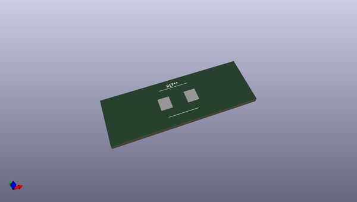
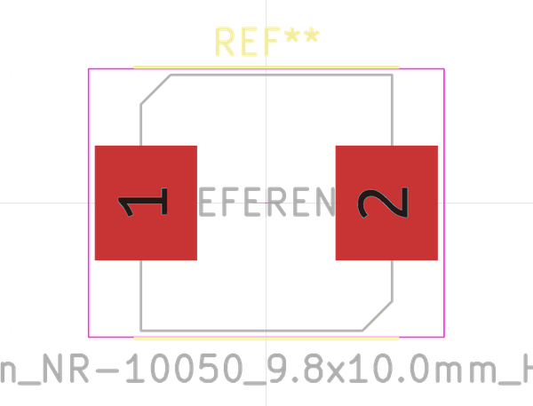
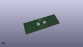

# OOMP Footprint  
## L_Taiyo-Yuden_NR-10050_9.8x10.0mm_HandSoldering  by none  
  
oomp key: oomp_kicad_inductor_smd_l_taiyo_yuden_nr_10050_9_8x10_0mm_handsoldering  
  
source repo at: [http://gitlab.com/kicad/kicad-footprints/blob/master/tmp/data//oomlout_oomp_footprint_src/Varistor.pretty/RV_Rect_V25S440P_L26.5mm_W8.2mm_P12.7mm.kicad_mod](http://gitlab.com/kicad/kicad-footprints/blob/master/tmp/data//oomlout_oomp_footprint_src/Varistor.pretty/RV_Rect_V25S440P_L26.5mm_W8.2mm_P12.7mm.kicad_mod)  
## Footprint  
  
  
  
  
| name | value | 
| --- | --- | 
| footprint name | L_Taiyo-Yuden_NR-10050_9.8x10.0mm_HandSoldering | 
| footprint description | Inductor, Taiyo Yuden, NR series, Taiyo-Yuden_NR-10050, 9.8mmx10.0mm, https://ds.yuden.co.jp/TYCOMPAS/or/specSheet?pn=NR10050T1R3N | 
| number of pads | 2 | 
| github path | http://github.com/kicad/kicad-footprints/blob/master/tmp/data//oomlout_oomp_footprint_src/Inductor_SMD.pretty/L_Taiyo-Yuden_NR-10050_9.8x10.0mm_HandSoldering.kicad_mod | 
| oomp key | oomp_kicad_inductor_smd_l_taiyo_yuden_nr_10050_9_8x10_0mm_handsoldering | 
| oomp bot github | https://github.com/oomlout/oomlout_oomp_footprint_bot/tree/main/tmp/data//oomlout_oomp_footprint_src/footprints/kicad_inductor_smd_l_taiyo_yuden_nr_10050_9_8x10_0mm_handsoldering/working | 
## Images  
  
  
  
  
  
  
  
  
