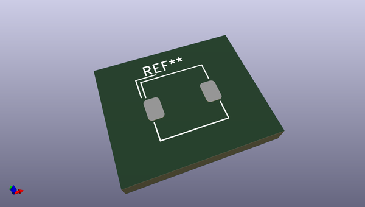
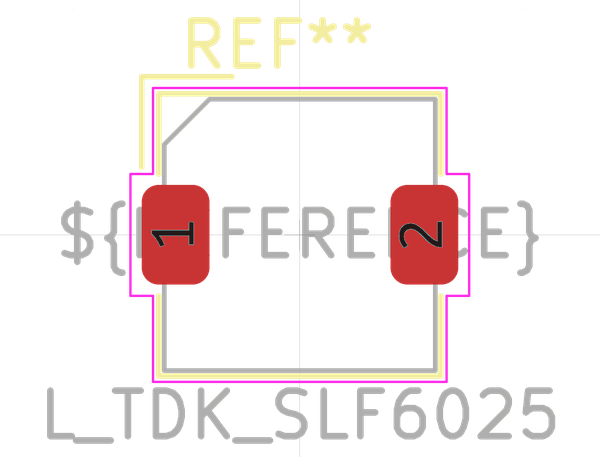
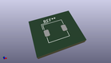
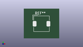

# OOMP Footprint  
## L_TDK_SLF6025  by none  
  
oomp key: oomp_kicad_inductor_smd_l_tdk_slf6025  
  
source repo at: [http://gitlab.com/kicad/kicad-footprints/blob/master/tmp/data//oomlout_oomp_footprint_src/Varistor.pretty/RV_Rect_V25S440P_L26.5mm_W8.2mm_P12.7mm.kicad_mod](http://gitlab.com/kicad/kicad-footprints/blob/master/tmp/data//oomlout_oomp_footprint_src/Varistor.pretty/RV_Rect_V25S440P_L26.5mm_W8.2mm_P12.7mm.kicad_mod)  
## Footprint  
  
  
  
  
| name | value | 
| --- | --- | 
| footprint name | L_TDK_SLF6025 | 
| footprint description | Inductor, TDK, SLF6025, 6.0mmx6.0mm (Script generated with StandardBox.py) (https://product.tdk.com/info/en/document/catalog/smd/inductor_commercial_power_slf6025_en.pdf) | 
| number of pads | 2 | 
| github path | http://github.com/kicad/kicad-footprints/blob/master/tmp/data//oomlout_oomp_footprint_src/Inductor_SMD.pretty/L_TDK_SLF6025.kicad_mod | 
| oomp key | oomp_kicad_inductor_smd_l_tdk_slf6025 | 
| oomp bot github | https://github.com/oomlout/oomlout_oomp_footprint_bot/tree/main/tmp/data//oomlout_oomp_footprint_src/footprints/kicad_inductor_smd_l_tdk_slf6025/working | 
## Images  
  
  
  
  
  
  
  
  
