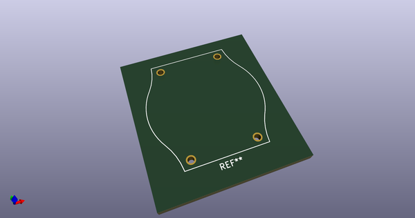
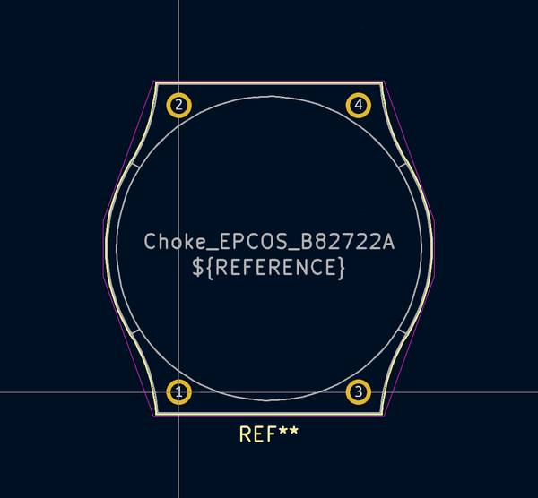
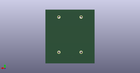
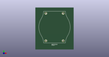

# OOMP Footprint  
## Choke_EPCOS_B82722A  by none  
  
oomp key: oomp_kicad_inductor_tht_choke_epcos_b82722a  
  
source repo at: [http://gitlab.com/kicad/kicad-footprints/blob/master/tmp/data//oomlout_oomp_footprint_src/Varistor.pretty/RV_Rect_V25S440P_L26.5mm_W8.2mm_P12.7mm.kicad_mod](http://gitlab.com/kicad/kicad-footprints/blob/master/tmp/data//oomlout_oomp_footprint_src/Varistor.pretty/RV_Rect_V25S440P_L26.5mm_W8.2mm_P12.7mm.kicad_mod)  
## Footprint  
  
  
  
  
| name | value | 
| --- | --- | 
| footprint name | Choke_EPCOS_B82722A | 
| footprint description | Current-Compensated Ring Core Double Chokes, EPCOS, B82722A, 22.3mmx22.7mm, https://en.tdk.eu/inf/30/db/ind_2008/b82722a_j.pdf | 
| number of pads | 4 | 
| github path | http://github.com/kicad/kicad-footprints/blob/master/tmp/data//oomlout_oomp_footprint_src/Inductor_THT.pretty/Choke_EPCOS_B82722A.kicad_mod | 
| oomp key | oomp_kicad_inductor_tht_choke_epcos_b82722a | 
| oomp bot github | https://github.com/oomlout/oomlout_oomp_footprint_bot/tree/main/tmp/data//oomlout_oomp_footprint_src/footprints/kicad_inductor_tht_choke_epcos_b82722a/working | 
## Images  
  
  
  
  
  
  
