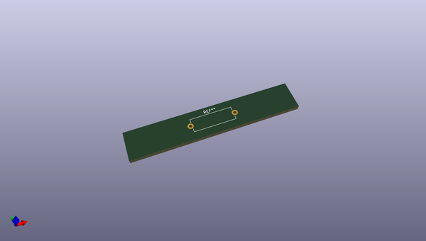
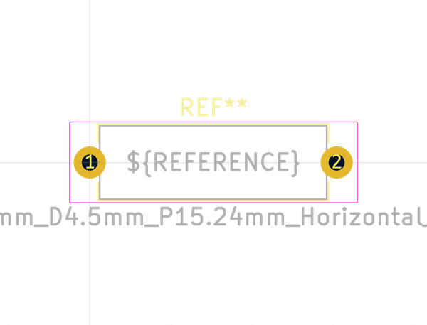
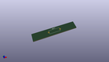

# OOMP Footprint  
## L_Axial_L14.0mm_D4.5mm_P15.24mm_Horizontal_Fastron_LACC  by none  
  
oomp key: oomp_kicad_inductor_tht_l_axial_l14_0mm_d4_5mm_p15_24mm_horizontal_fastron_lacc  
  
source repo at: [http://gitlab.com/kicad/kicad-footprints/blob/master/tmp/data//oomlout_oomp_footprint_src/Varistor.pretty/RV_Rect_V25S440P_L26.5mm_W8.2mm_P12.7mm.kicad_mod](http://gitlab.com/kicad/kicad-footprints/blob/master/tmp/data//oomlout_oomp_footprint_src/Varistor.pretty/RV_Rect_V25S440P_L26.5mm_W8.2mm_P12.7mm.kicad_mod)  
## Footprint  
  
  
  
  
| name | value | 
| --- | --- | 
| footprint name | L_Axial_L14.0mm_D4.5mm_P15.24mm_Horizontal_Fastron_LACC | 
| footprint description | Inductor, Axial series, Axial, Horizontal, pin pitch=15.24mm, , length*diameter=14*4.5mm^2, Fastron, LACC, http://www.fastrongroup.com/image-show/20/LACC.pdf?type=Complete-DataSheet&productType=series | 
| number of pads | 2 | 
| github path | http://github.com/kicad/kicad-footprints/blob/master/tmp/data//oomlout_oomp_footprint_src/Inductor_THT.pretty/L_Axial_L14.0mm_D4.5mm_P15.24mm_Horizontal_Fastron_LACC.kicad_mod | 
| oomp key | oomp_kicad_inductor_tht_l_axial_l14_0mm_d4_5mm_p15_24mm_horizontal_fastron_lacc | 
| oomp bot github | https://github.com/oomlout/oomlout_oomp_footprint_bot/tree/main/tmp/data//oomlout_oomp_footprint_src/footprints/kicad_inductor_tht_l_axial_l14_0mm_d4_5mm_p15_24mm_horizontal_fastron_lacc/working | 
## Images  
  
  
  
  
  
  
  
  
