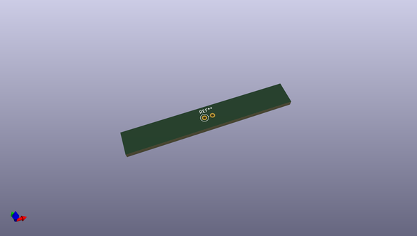
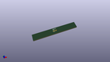

# OOMP Footprint  
## L_Axial_L5.3mm_D2.2mm_P2.54mm_Vertical_Vishay_IM-1  by none  
  
oomp key: oomp_kicad_inductor_tht_l_axial_l5_3mm_d2_2mm_p2_54mm_vertical_vishay_im_1  
  
source repo at: [http://gitlab.com/kicad/kicad-footprints/blob/master/tmp/data//oomlout_oomp_footprint_src/Varistor.pretty/RV_Rect_V25S440P_L26.5mm_W8.2mm_P12.7mm.kicad_mod](http://gitlab.com/kicad/kicad-footprints/blob/master/tmp/data//oomlout_oomp_footprint_src/Varistor.pretty/RV_Rect_V25S440P_L26.5mm_W8.2mm_P12.7mm.kicad_mod)  
## Footprint  
  
  
  
  
| name | value | 
| --- | --- | 
| footprint name | L_Axial_L5.3mm_D2.2mm_P2.54mm_Vertical_Vishay_IM-1 | 
| footprint description | Inductor, Axial series, Axial, Vertical, pin pitch=2.54mm, , length*diameter=5.3*2.2mm^2, Vishay, IM-1, http://www.vishay.com/docs/34030/im.pdf | 
| number of pads | 2 | 
| github path | http://github.com/kicad/kicad-footprints/blob/master/tmp/data//oomlout_oomp_footprint_src/Inductor_THT.pretty/L_Axial_L5.3mm_D2.2mm_P2.54mm_Vertical_Vishay_IM-1.kicad_mod | 
| oomp key | oomp_kicad_inductor_tht_l_axial_l5_3mm_d2_2mm_p2_54mm_vertical_vishay_im_1 | 
| oomp bot github | https://github.com/oomlout/oomlout_oomp_footprint_bot/tree/main/tmp/data//oomlout_oomp_footprint_src/footprints/kicad_inductor_tht_l_axial_l5_3mm_d2_2mm_p2_54mm_vertical_vishay_im_1/working | 
## Images  
  
  
  
  
  
  
  
  
