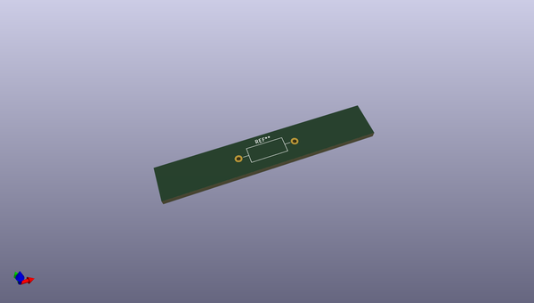
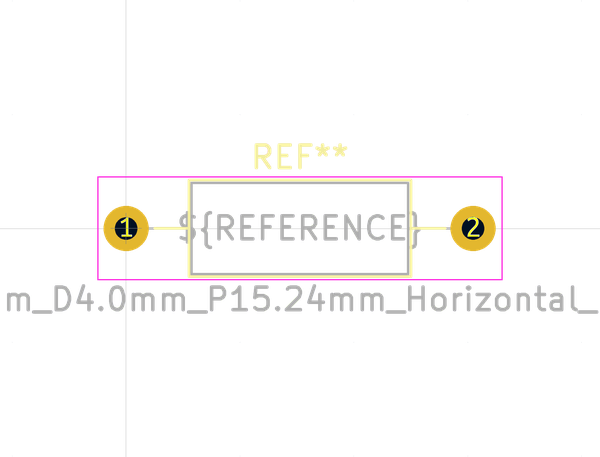
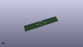
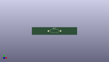

# OOMP Footprint  
## L_Axial_L9.5mm_D4.0mm_P15.24mm_Horizontal_Fastron_SMCC  by none  
  
oomp key: oomp_kicad_inductor_tht_l_axial_l9_5mm_d4_0mm_p15_24mm_horizontal_fastron_smcc  
  
source repo at: [http://gitlab.com/kicad/kicad-footprints/blob/master/tmp/data//oomlout_oomp_footprint_src/Varistor.pretty/RV_Rect_V25S440P_L26.5mm_W8.2mm_P12.7mm.kicad_mod](http://gitlab.com/kicad/kicad-footprints/blob/master/tmp/data//oomlout_oomp_footprint_src/Varistor.pretty/RV_Rect_V25S440P_L26.5mm_W8.2mm_P12.7mm.kicad_mod)  
## Footprint  
  
  
  
  
| name | value | 
| --- | --- | 
| footprint name | L_Axial_L9.5mm_D4.0mm_P15.24mm_Horizontal_Fastron_SMCC | 
| footprint description | Inductor, Axial series, Axial, Horizontal, pin pitch=15.24mm, , length*diameter=9.5*4mm^2, Fastron, SMCC, http://cdn-reichelt.de/documents/datenblatt/B400/DS_SMCC_NEU.pdf, http://cdn-reichelt.de/documents/datenblatt/B400/LEADEDINDUCTORS.pdf | 
| number of pads | 2 | 
| github path | http://github.com/kicad/kicad-footprints/blob/master/tmp/data//oomlout_oomp_footprint_src/Inductor_THT.pretty/L_Axial_L9.5mm_D4.0mm_P15.24mm_Horizontal_Fastron_SMCC.kicad_mod | 
| oomp key | oomp_kicad_inductor_tht_l_axial_l9_5mm_d4_0mm_p15_24mm_horizontal_fastron_smcc | 
| oomp bot github | https://github.com/oomlout/oomlout_oomp_footprint_bot/tree/main/tmp/data//oomlout_oomp_footprint_src/footprints/kicad_inductor_tht_l_axial_l9_5mm_d4_0mm_p15_24mm_horizontal_fastron_smcc/working | 
## Images  
  
  
  
  
  
  
  
  
