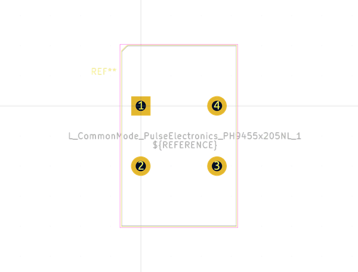
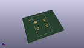

# OOMP Footprint  
## L_CommonMode_PulseElectronics_PH9455x205NL_1  by none  
  
oomp key: oomp_kicad_inductor_tht_l_commonmode_pulseelectronics_ph9455x205nl_1  
  
source repo at: [http://gitlab.com/kicad/kicad-footprints/blob/master/tmp/data//oomlout_oomp_footprint_src/Varistor.pretty/RV_Rect_V25S440P_L26.5mm_W8.2mm_P12.7mm.kicad_mod](http://gitlab.com/kicad/kicad-footprints/blob/master/tmp/data//oomlout_oomp_footprint_src/Varistor.pretty/RV_Rect_V25S440P_L26.5mm_W8.2mm_P12.7mm.kicad_mod)  
## Footprint  
  
  
  
  
| name | value | 
| --- | --- | 
| footprint name | L_CommonMode_PulseElectronics_PH9455x205NL_1 | 
| footprint description | common mode, inductor, filter, https://productfinder.pulseelectronics.com/api/open/product-attachments/datasheet/ph9455.105nl | 
| number of pads | 4 | 
| github path | http://github.com/kicad/kicad-footprints/blob/master/tmp/data//oomlout_oomp_footprint_src/Inductor_THT.pretty/L_CommonMode_PulseElectronics_PH9455x205NL_1.kicad_mod | 
| oomp key | oomp_kicad_inductor_tht_l_commonmode_pulseelectronics_ph9455x205nl_1 | 
| oomp bot github | https://github.com/oomlout/oomlout_oomp_footprint_bot/tree/main/tmp/data//oomlout_oomp_footprint_src/footprints/kicad_inductor_tht_l_commonmode_pulseelectronics_ph9455x205nl_1/working | 
## Images  
  
  
  
  
  
  
  
  
