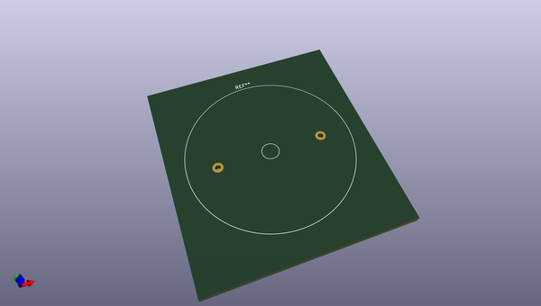
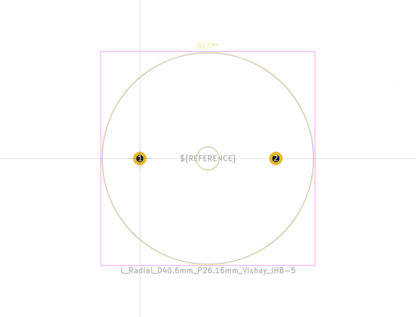
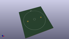
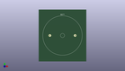

# OOMP Footprint  
## L_Radial_D40.6mm_P26.16mm_Vishay_IHB-5  by none  
  
oomp key: oomp_kicad_inductor_tht_l_radial_d40_6mm_p26_16mm_vishay_ihb_5  
  
source repo at: [http://gitlab.com/kicad/kicad-footprints/blob/master/tmp/data//oomlout_oomp_footprint_src/Varistor.pretty/RV_Rect_V25S440P_L26.5mm_W8.2mm_P12.7mm.kicad_mod](http://gitlab.com/kicad/kicad-footprints/blob/master/tmp/data//oomlout_oomp_footprint_src/Varistor.pretty/RV_Rect_V25S440P_L26.5mm_W8.2mm_P12.7mm.kicad_mod)  
## Footprint  
  
  
  
  
| name | value | 
| --- | --- | 
| footprint name | L_Radial_D40.6mm_P26.16mm_Vishay_IHB-5 | 
| footprint description | Inductor, Radial series, Radial, pin pitch=26.16mm, , diameter=40.64mm, Vishay, IHB-5, http://www.vishay.com/docs/34015/ihb.pdf | 
| number of pads | 2 | 
| github path | http://github.com/kicad/kicad-footprints/blob/master/tmp/data//oomlout_oomp_footprint_src/Inductor_THT.pretty/L_Radial_D40.6mm_P26.16mm_Vishay_IHB-5.kicad_mod | 
| oomp key | oomp_kicad_inductor_tht_l_radial_d40_6mm_p26_16mm_vishay_ihb_5 | 
| oomp bot github | https://github.com/oomlout/oomlout_oomp_footprint_bot/tree/main/tmp/data//oomlout_oomp_footprint_src/footprints/kicad_inductor_tht_l_radial_d40_6mm_p26_16mm_vishay_ihb_5/working | 
## Images  
  
  
  
  
  
  
  
  
