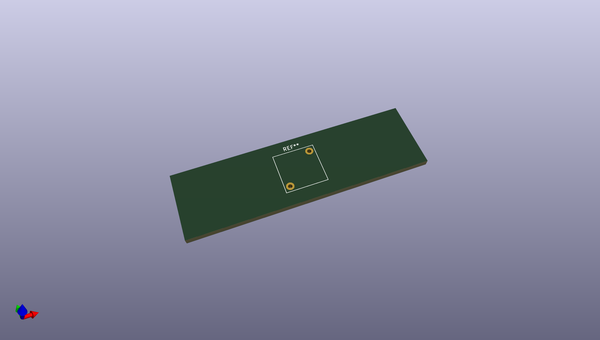
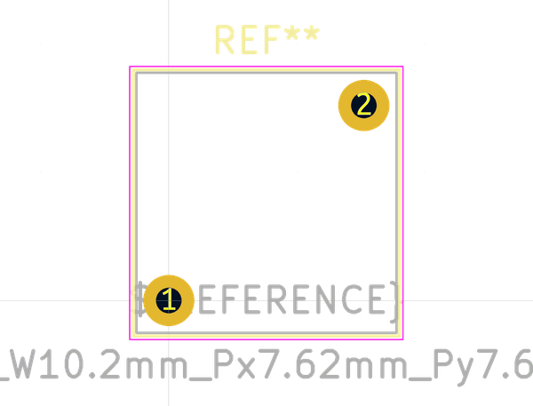
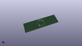

# OOMP Footprint  
## L_Radial_L10.2mm_W10.2mm_Px7.62mm_Py7.62mm_Pulse_LP-30  by none  
  
oomp key: oomp_kicad_inductor_tht_l_radial_l10_2mm_w10_2mm_px7_62mm_py7_62mm_pulse_lp_30  
  
source repo at: [http://gitlab.com/kicad/kicad-footprints/blob/master/tmp/data//oomlout_oomp_footprint_src/Varistor.pretty/RV_Rect_V25S440P_L26.5mm_W8.2mm_P12.7mm.kicad_mod](http://gitlab.com/kicad/kicad-footprints/blob/master/tmp/data//oomlout_oomp_footprint_src/Varistor.pretty/RV_Rect_V25S440P_L26.5mm_W8.2mm_P12.7mm.kicad_mod)  
## Footprint  
  
  
  
  
| name | value | 
| --- | --- | 
| footprint name | L_Radial_L10.2mm_W10.2mm_Px7.62mm_Py7.62mm_Pulse_LP-30 | 
| footprint description | Inductor, Radial series, Radial, pin pitch=7.62*7.62mm^2, , length*width=10.16*10.16mm^2, Pulse, LP-30, http://datasheet.octopart.com/PE-54044NL-Pulse-datasheet-5313493.pdf | 
| number of pads | 2 | 
| github path | http://github.com/kicad/kicad-footprints/blob/master/tmp/data//oomlout_oomp_footprint_src/Inductor_THT.pretty/L_Radial_L10.2mm_W10.2mm_Px7.62mm_Py7.62mm_Pulse_LP-30.kicad_mod | 
| oomp key | oomp_kicad_inductor_tht_l_radial_l10_2mm_w10_2mm_px7_62mm_py7_62mm_pulse_lp_30 | 
| oomp bot github | https://github.com/oomlout/oomlout_oomp_footprint_bot/tree/main/tmp/data//oomlout_oomp_footprint_src/footprints/kicad_inductor_tht_l_radial_l10_2mm_w10_2mm_px7_62mm_py7_62mm_pulse_lp_30/working | 
## Images  
  
  
  
  
  
  
  
  
