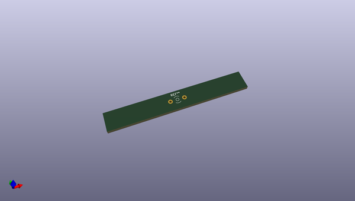
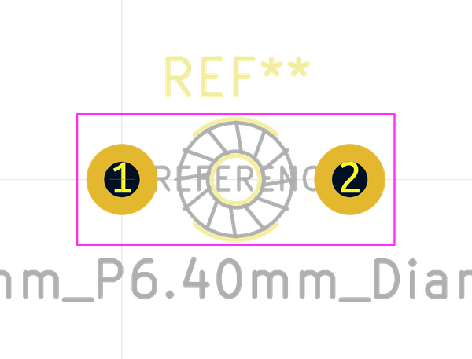
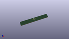
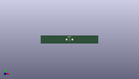

# OOMP Footprint  
## L_Toroid_Horizontal_D3.2mm_P6.40mm_Diameter3-5mm_Amidon-T12  by none  
  
oomp key: oomp_kicad_inductor_tht_l_toroid_horizontal_d3_2mm_p6_40mm_diameter3_5mm_amidon_t12  
  
source repo at: [http://gitlab.com/kicad/kicad-footprints/blob/master/tmp/data//oomlout_oomp_footprint_src/Varistor.pretty/RV_Rect_V25S440P_L26.5mm_W8.2mm_P12.7mm.kicad_mod](http://gitlab.com/kicad/kicad-footprints/blob/master/tmp/data//oomlout_oomp_footprint_src/Varistor.pretty/RV_Rect_V25S440P_L26.5mm_W8.2mm_P12.7mm.kicad_mod)  
## Footprint  
  
  
  
  
| name | value | 
| --- | --- | 
| footprint name | L_Toroid_Horizontal_D3.2mm_P6.40mm_Diameter3-5mm_Amidon-T12 | 
| footprint description | L_Toroid, Horizontal series, Radial, pin pitch=6.40mm, , diameter=3.175mm, Diameter3-5mm, Amidon-T12 | 
| number of pads | 2 | 
| github path | http://github.com/kicad/kicad-footprints/blob/master/tmp/data//oomlout_oomp_footprint_src/Inductor_THT.pretty/L_Toroid_Horizontal_D3.2mm_P6.40mm_Diameter3-5mm_Amidon-T12.kicad_mod | 
| oomp key | oomp_kicad_inductor_tht_l_toroid_horizontal_d3_2mm_p6_40mm_diameter3_5mm_amidon_t12 | 
| oomp bot github | https://github.com/oomlout/oomlout_oomp_footprint_bot/tree/main/tmp/data//oomlout_oomp_footprint_src/footprints/kicad_inductor_tht_l_toroid_horizontal_d3_2mm_p6_40mm_diameter3_5mm_amidon_t12/working | 
## Images  
  
  
  
  
  
  
