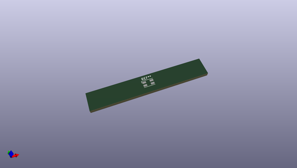
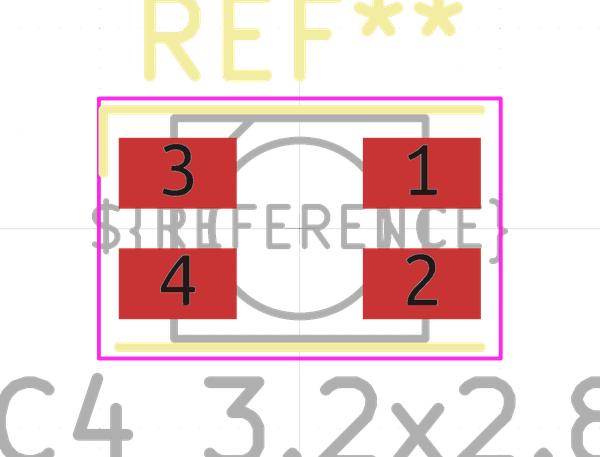
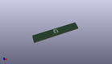

# OOMP Footprint  
## LED_RGB_Wuerth-PLCC4_3.2x2.8mm_150141M173100  by none  
  
oomp key: oomp_kicad_led_smd_led_rgb_wuerth_plcc4_3_2x2_8mm_150141m173100  
  
source repo at: [http://gitlab.com/kicad/kicad-footprints/blob/master/tmp/data//oomlout_oomp_footprint_src/Varistor.pretty/RV_Rect_V25S440P_L26.5mm_W8.2mm_P12.7mm.kicad_mod](http://gitlab.com/kicad/kicad-footprints/blob/master/tmp/data//oomlout_oomp_footprint_src/Varistor.pretty/RV_Rect_V25S440P_L26.5mm_W8.2mm_P12.7mm.kicad_mod)  
## Footprint  
  
  
  
  
| name | value | 
| --- | --- | 
| footprint name | LED_RGB_Wuerth-PLCC4_3.2x2.8mm_150141M173100 | 
| footprint description | 3.2mm x 2.8mm PLCC4 LED, https://www.we-online.de/katalog/datasheet/150141M173100.pdf | 
| number of pads | 4 | 
| github path | http://github.com/kicad/kicad-footprints/blob/master/tmp/data//oomlout_oomp_footprint_src/LED_SMD.pretty/LED_RGB_Wuerth-PLCC4_3.2x2.8mm_150141M173100.kicad_mod | 
| oomp key | oomp_kicad_led_smd_led_rgb_wuerth_plcc4_3_2x2_8mm_150141m173100 | 
| oomp bot github | https://github.com/oomlout/oomlout_oomp_footprint_bot/tree/main/tmp/data//oomlout_oomp_footprint_src/footprints/kicad_led_smd_led_rgb_wuerth_plcc4_3_2x2_8mm_150141m173100/working | 
## Images  
  
  
  
  
  
  
