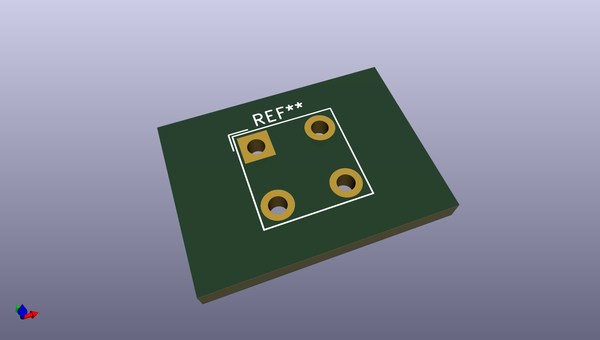
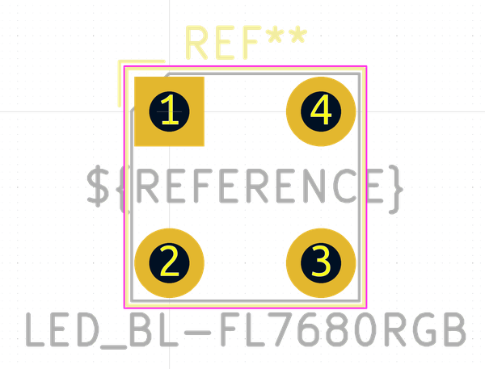
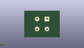
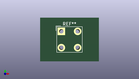

# OOMP Footprint  
## LED_BL-FL7680RGB  by none  
  
oomp key: oomp_kicad_led_tht_led_bl_fl7680rgb  
  
source repo at: [http://gitlab.com/kicad/kicad-footprints/blob/master/tmp/data//oomlout_oomp_footprint_src/Varistor.pretty/RV_Rect_V25S440P_L26.5mm_W8.2mm_P12.7mm.kicad_mod](http://gitlab.com/kicad/kicad-footprints/blob/master/tmp/data//oomlout_oomp_footprint_src/Varistor.pretty/RV_Rect_V25S440P_L26.5mm_W8.2mm_P12.7mm.kicad_mod)  
## Footprint  
  
  
  
  
| name | value | 
| --- | --- | 
| footprint name | LED_BL-FL7680RGB | 
| footprint description | 'Piranha' RGB LED, through hole, common anode, 7.62x7.62mm, BGRA pin order, https://cdn-shop.adafruit.com/datasheets/BL-FL7680RGB.pdf | 
| number of pads | 4 | 
| github path | http://github.com/kicad/kicad-footprints/blob/master/tmp/data//oomlout_oomp_footprint_src/LED_THT.pretty/LED_BL-FL7680RGB.kicad_mod | 
| oomp key | oomp_kicad_led_tht_led_bl_fl7680rgb | 
| oomp bot github | https://github.com/oomlout/oomlout_oomp_footprint_bot/tree/main/tmp/data//oomlout_oomp_footprint_src/footprints/kicad_led_tht_led_bl_fl7680rgb/working | 
## Images  
  
  
  
  
  
  
  
  
