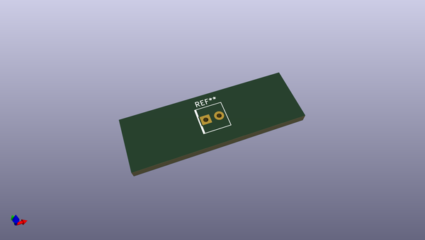
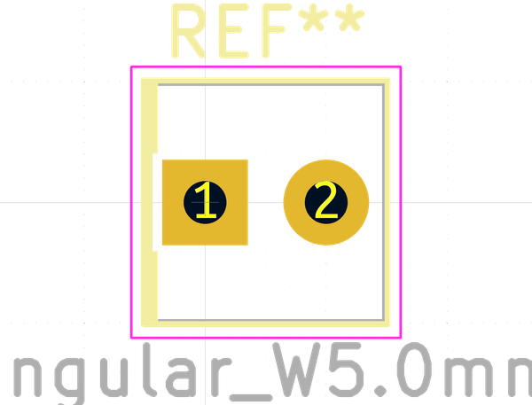
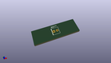

# OOMP Footprint  
## LED_Rectangular_W5.0mm_H5.0mm  by none  
  
oomp key: oomp_kicad_led_tht_led_rectangular_w5_0mm_h5_0mm  
  
source repo at: [http://gitlab.com/kicad/kicad-footprints/blob/master/tmp/data//oomlout_oomp_footprint_src/Varistor.pretty/RV_Rect_V25S440P_L26.5mm_W8.2mm_P12.7mm.kicad_mod](http://gitlab.com/kicad/kicad-footprints/blob/master/tmp/data//oomlout_oomp_footprint_src/Varistor.pretty/RV_Rect_V25S440P_L26.5mm_W8.2mm_P12.7mm.kicad_mod)  
## Footprint  
  
  
  
  
| name | value | 
| --- | --- | 
| footprint name | LED_Rectangular_W5.0mm_H5.0mm | 
| footprint description | LED_Rectangular, Rectangular,  Rectangular size 5.0x5.0mm^2, 2 pins, http://www.kingbright.com/attachments/file/psearch/000/00/00/L-169XCGDK(Ver.9B).pdf | 
| number of pads | 2 | 
| github path | http://github.com/kicad/kicad-footprints/blob/master/tmp/data//oomlout_oomp_footprint_src/LED_THT.pretty/LED_Rectangular_W5.0mm_H5.0mm.kicad_mod | 
| oomp key | oomp_kicad_led_tht_led_rectangular_w5_0mm_h5_0mm | 
| oomp bot github | https://github.com/oomlout/oomlout_oomp_footprint_bot/tree/main/tmp/data//oomlout_oomp_footprint_src/footprints/kicad_led_tht_led_rectangular_w5_0mm_h5_0mm/working | 
## Images  
  
  
  
  
  
  
  
  
