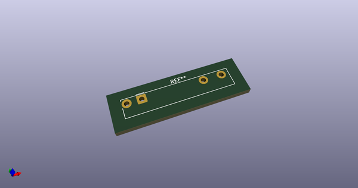
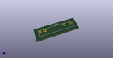

# OOMP Footprint  
## Finder_34.81  by none  
  
oomp key: oomp_kicad_optodevice_finder_34_81  
  
source repo at: [http://gitlab.com/kicad/kicad-footprints/blob/master/tmp/data//oomlout_oomp_footprint_src/Varistor.pretty/RV_Rect_V25S440P_L26.5mm_W8.2mm_P12.7mm.kicad_mod](http://gitlab.com/kicad/kicad-footprints/blob/master/tmp/data//oomlout_oomp_footprint_src/Varistor.pretty/RV_Rect_V25S440P_L26.5mm_W8.2mm_P12.7mm.kicad_mod)  
## Footprint  
  
  
  
  
| name | value | 
| --- | --- | 
| footprint name | Finder_34.81 | 
| footprint description | Relay SPST, Finder Type 34.81 (opto relays/coupler), vertical/standing form, see https://gfinder.findernet.com/public/attachments/34/EN/S34USAEN.pdf | 
| number of pads | 4 | 
| github path | http://github.com/kicad/kicad-footprints/blob/master/tmp/data//oomlout_oomp_footprint_src/OptoDevice.pretty/Finder_34.81.kicad_mod | 
| oomp key | oomp_kicad_optodevice_finder_34_81 | 
| oomp bot github | https://github.com/oomlout/oomlout_oomp_footprint_bot/tree/main/tmp/data//oomlout_oomp_footprint_src/footprints/kicad_optodevice_finder_34_81/working | 
## Images  
  
  
  
  
  
  
  
  
