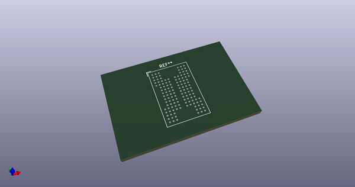
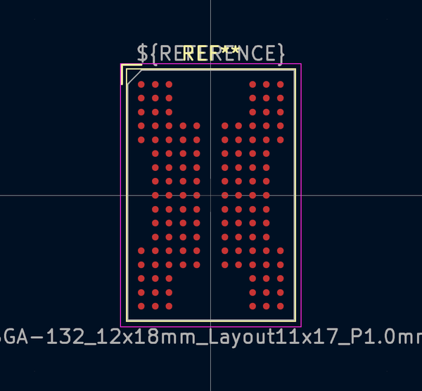
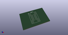
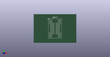

# OOMP Footprint  
## BGA-132_12x18mm_Layout11x17_P1.0mm  by none  
  
oomp key: oomp_kicad_package_bga_bga_132_12x18mm_layout11x17_p1_0mm  
  
source repo at: [http://gitlab.com/kicad/kicad-footprints/blob/master/tmp/data//oomlout_oomp_footprint_src/Varistor.pretty/RV_Rect_V25S440P_L26.5mm_W8.2mm_P12.7mm.kicad_mod](http://gitlab.com/kicad/kicad-footprints/blob/master/tmp/data//oomlout_oomp_footprint_src/Varistor.pretty/RV_Rect_V25S440P_L26.5mm_W8.2mm_P12.7mm.kicad_mod)  
## Footprint  
  
  
  
  
| name | value | 
| --- | --- | 
| footprint name | BGA-132_12x18mm_Layout11x17_P1.0mm | 
| footprint description | BGA-132 11x17 12x18mm 1.0pitch | 
| number of pads | 132 | 
| github path | http://github.com/kicad/kicad-footprints/blob/master/tmp/data//oomlout_oomp_footprint_src/Package_BGA.pretty/BGA-132_12x18mm_Layout11x17_P1.0mm.kicad_mod | 
| oomp key | oomp_kicad_package_bga_bga_132_12x18mm_layout11x17_p1_0mm | 
| oomp bot github | https://github.com/oomlout/oomlout_oomp_footprint_bot/tree/main/tmp/data//oomlout_oomp_footprint_src/footprints/kicad_package_bga_bga_132_12x18mm_layout11x17_p1_0mm/working | 
## Images  
  
  
  
  
  
  
  
  
