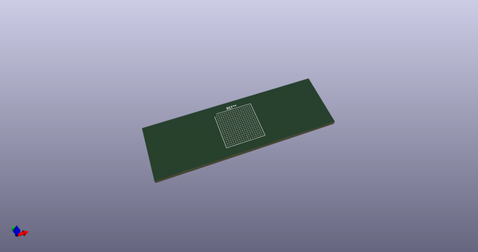
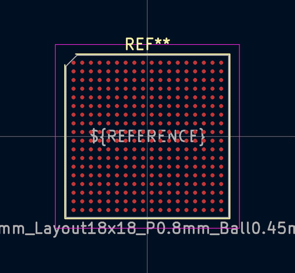
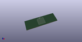

# OOMP Footprint  
## BGA-324_15.0x15.0mm_Layout18x18_P0.8mm_Ball0.45mm_Pad0.4mm_NSMD  by none  
  
oomp key: oomp_kicad_package_bga_bga_324_15_0x15_0mm_layout18x18_p0_8mm_ball0_45mm_pad0_4mm_nsmd  
  
source repo at: [http://gitlab.com/kicad/kicad-footprints/blob/master/tmp/data//oomlout_oomp_footprint_src/Varistor.pretty/RV_Rect_V25S440P_L26.5mm_W8.2mm_P12.7mm.kicad_mod](http://gitlab.com/kicad/kicad-footprints/blob/master/tmp/data//oomlout_oomp_footprint_src/Varistor.pretty/RV_Rect_V25S440P_L26.5mm_W8.2mm_P12.7mm.kicad_mod)  
## Footprint  
  
  
  
  
| name | value | 
| --- | --- | 
| footprint name | BGA-324_15.0x15.0mm_Layout18x18_P0.8mm_Ball0.45mm_Pad0.4mm_NSMD | 
| footprint description | BGA-324, 15x15mm, 324 Ball, 18x18 Layout, 0.8mm Pitch, https://colognechip.com/docs/ds1001-gatemate1-datasheet-2022-05.pdf#page=92 | 
| number of pads | 324 | 
| github path | http://github.com/kicad/kicad-footprints/blob/master/tmp/data//oomlout_oomp_footprint_src/Package_BGA.pretty/BGA-324_15.0x15.0mm_Layout18x18_P0.8mm_Ball0.45mm_Pad0.4mm_NSMD.kicad_mod | 
| oomp key | oomp_kicad_package_bga_bga_324_15_0x15_0mm_layout18x18_p0_8mm_ball0_45mm_pad0_4mm_nsmd | 
| oomp bot github | https://github.com/oomlout/oomlout_oomp_footprint_bot/tree/main/tmp/data//oomlout_oomp_footprint_src/footprints/kicad_package_bga_bga_324_15_0x15_0mm_layout18x18_p0_8mm_ball0_45mm_pad0_4mm_nsmd/working | 
## Images  
  
  
  
  
  
  
  
  
