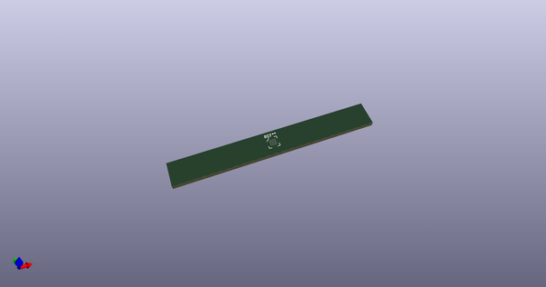
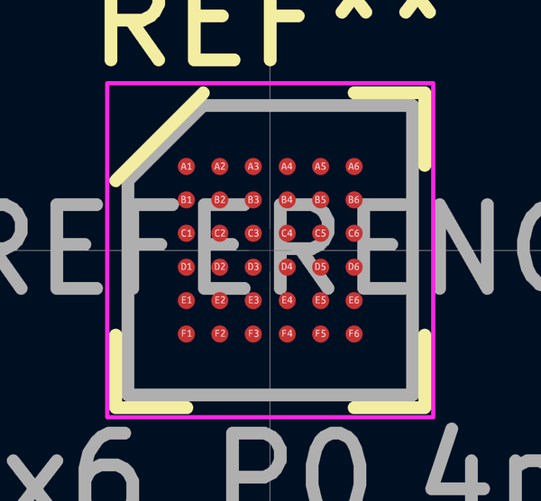
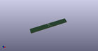
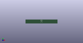

# OOMP Footprint  
## BGA-36_3.396x3.466mm_Layout6x6_P0.4mm_Ball0.25mm_Pad0.2mm_NSMD  by none  
  
oomp key: oomp_kicad_package_bga_bga_36_3_396x3_466mm_layout6x6_p0_4mm_ball0_25mm_pad0_2mm_nsmd  
  
source repo at: [http://gitlab.com/kicad/kicad-footprints/blob/master/tmp/data//oomlout_oomp_footprint_src/Varistor.pretty/RV_Rect_V25S440P_L26.5mm_W8.2mm_P12.7mm.kicad_mod](http://gitlab.com/kicad/kicad-footprints/blob/master/tmp/data//oomlout_oomp_footprint_src/Varistor.pretty/RV_Rect_V25S440P_L26.5mm_W8.2mm_P12.7mm.kicad_mod)  
## Footprint  
  
  
  
  
| name | value | 
| --- | --- | 
| footprint name | BGA-36_3.396x3.466mm_Layout6x6_P0.4mm_Ball0.25mm_Pad0.2mm_NSMD | 
| footprint description | Altera V36, https://www.altera.com/content/dam/altera-www/global/en_US/pdfs/literature/packaging/04r00486-00.pdf | 
| number of pads | 36 | 
| github path | http://github.com/kicad/kicad-footprints/blob/master/tmp/data//oomlout_oomp_footprint_src/Package_BGA.pretty/BGA-36_3.396x3.466mm_Layout6x6_P0.4mm_Ball0.25mm_Pad0.2mm_NSMD.kicad_mod | 
| oomp key | oomp_kicad_package_bga_bga_36_3_396x3_466mm_layout6x6_p0_4mm_ball0_25mm_pad0_2mm_nsmd | 
| oomp bot github | https://github.com/oomlout/oomlout_oomp_footprint_bot/tree/main/tmp/data//oomlout_oomp_footprint_src/footprints/kicad_package_bga_bga_36_3_396x3_466mm_layout6x6_p0_4mm_ball0_25mm_pad0_2mm_nsmd/working | 
## Images  
  
  
  
  
  
  
  
  
