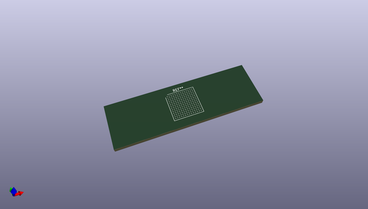
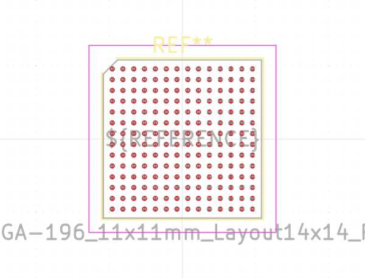
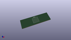
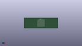

# OOMP Footprint  
## Microchip_TFBGA-196_11x11mm_Layout14x14_P0.75mm_SMD  by none  
  
oomp key: oomp_kicad_package_bga_microchip_tfbga_196_11x11mm_layout14x14_p0_75mm_smd  
  
source repo at: [http://gitlab.com/kicad/kicad-footprints/blob/master/tmp/data//oomlout_oomp_footprint_src/Varistor.pretty/RV_Rect_V25S440P_L26.5mm_W8.2mm_P12.7mm.kicad_mod](http://gitlab.com/kicad/kicad-footprints/blob/master/tmp/data//oomlout_oomp_footprint_src/Varistor.pretty/RV_Rect_V25S440P_L26.5mm_W8.2mm_P12.7mm.kicad_mod)  
## Footprint  
  
  
  
  
| name | value | 
| --- | --- | 
| footprint name | Microchip_TFBGA-196_11x11mm_Layout14x14_P0.75mm_SMD | 
| footprint description | TFBGA-196, 11.0x11.0mm, 196 Ball, 14x14 Layout, 0.75mm Pitch, http://ww1.microchip.com/downloads/en/DeviceDoc/SAMA5D2-Series-Data-Sheet-DS60001476C.pdf#page=2956 | 
| number of pads | 196 | 
| github path | http://github.com/kicad/kicad-footprints/blob/master/tmp/data//oomlout_oomp_footprint_src/Package_BGA.pretty/Microchip_TFBGA-196_11x11mm_Layout14x14_P0.75mm_SMD.kicad_mod | 
| oomp key | oomp_kicad_package_bga_microchip_tfbga_196_11x11mm_layout14x14_p0_75mm_smd | 
| oomp bot github | https://github.com/oomlout/oomlout_oomp_footprint_bot/tree/main/tmp/data//oomlout_oomp_footprint_src/footprints/kicad_package_bga_microchip_tfbga_196_11x11mm_layout14x14_p0_75mm_smd/working | 
## Images  
  
  
  
  
  
  
  
  
