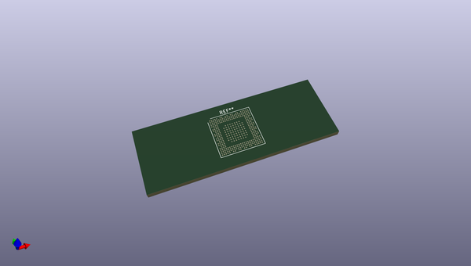
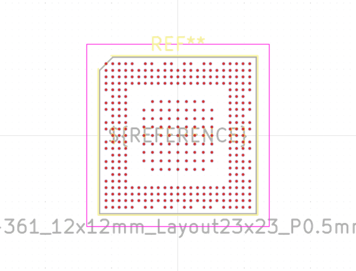
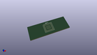

# OOMP Footprint  
## ST_TFBGA-361_12x12mm_Layout23x23_P0.5mmP0.65mm  by none  
  
oomp key: oomp_kicad_package_bga_st_tfbga_361_12x12mm_layout23x23_p0_5mmp0_65mm  
  
source repo at: [http://gitlab.com/kicad/kicad-footprints/blob/master/tmp/data//oomlout_oomp_footprint_src/Varistor.pretty/RV_Rect_V25S440P_L26.5mm_W8.2mm_P12.7mm.kicad_mod](http://gitlab.com/kicad/kicad-footprints/blob/master/tmp/data//oomlout_oomp_footprint_src/Varistor.pretty/RV_Rect_V25S440P_L26.5mm_W8.2mm_P12.7mm.kicad_mod)  
## Footprint  
  
  
  
  
| name | value | 
| --- | --- | 
| footprint name | ST_TFBGA-361_12x12mm_Layout23x23_P0.5mmP0.65mm | 
| footprint description | ST TFBGA-361, 12.0x12.0mm, 361 Ball, 23x23 Layout, 0.5mm Pitch, https://www.st.com/resource/en/datasheet/stm32mp151a.pdf | 
| number of pads | 361 | 
| github path | http://github.com/kicad/kicad-footprints/blob/master/tmp/data//oomlout_oomp_footprint_src/Package_BGA.pretty/ST_TFBGA-361_12x12mm_Layout23x23_P0.5mmP0.65mm.kicad_mod | 
| oomp key | oomp_kicad_package_bga_st_tfbga_361_12x12mm_layout23x23_p0_5mmp0_65mm | 
| oomp bot github | https://github.com/oomlout/oomlout_oomp_footprint_bot/tree/main/tmp/data//oomlout_oomp_footprint_src/footprints/kicad_package_bga_st_tfbga_361_12x12mm_layout23x23_p0_5mmp0_65mm/working | 
## Images  
  
  
  
  
  
  
  
  
