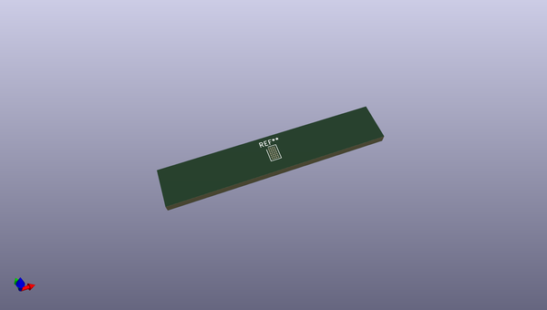
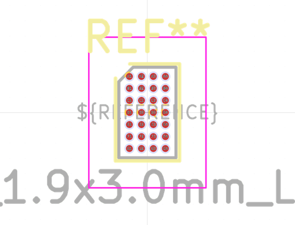
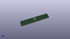

# OOMP Footprint  
## Texas_DSBGA-28_1.9x3.0mm_Layout4x7_P0.4mm  by none  
  
oomp key: oomp_kicad_package_bga_texas_dsbga_28_1_9x3_0mm_layout4x7_p0_4mm  
  
source repo at: [http://gitlab.com/kicad/kicad-footprints/blob/master/tmp/data//oomlout_oomp_footprint_src/Varistor.pretty/RV_Rect_V25S440P_L26.5mm_W8.2mm_P12.7mm.kicad_mod](http://gitlab.com/kicad/kicad-footprints/blob/master/tmp/data//oomlout_oomp_footprint_src/Varistor.pretty/RV_Rect_V25S440P_L26.5mm_W8.2mm_P12.7mm.kicad_mod)  
## Footprint  
  
  
  
  
| name | value | 
| --- | --- | 
| footprint name | Texas_DSBGA-28_1.9x3.0mm_Layout4x7_P0.4mm | 
| footprint description | Texas Instruments, DSBGA, 3.0x1.9x0.625mm, 28 ball 7x4 area grid, NSMD pad definition (http://www.ti.com/lit/ds/symlink/bq51050b.pdf, http://www.ti.com/lit/an/snva009ag/snva009ag.pdf) | 
| number of pads | 28 | 
| github path | http://github.com/kicad/kicad-footprints/blob/master/tmp/data//oomlout_oomp_footprint_src/Package_BGA.pretty/Texas_DSBGA-28_1.9x3.0mm_Layout4x7_P0.4mm.kicad_mod | 
| oomp key | oomp_kicad_package_bga_texas_dsbga_28_1_9x3_0mm_layout4x7_p0_4mm | 
| oomp bot github | https://github.com/oomlout/oomlout_oomp_footprint_bot/tree/main/tmp/data//oomlout_oomp_footprint_src/footprints/kicad_package_bga_texas_dsbga_28_1_9x3_0mm_layout4x7_p0_4mm/working | 
## Images  
  
  
  
  
  
  
  
  
