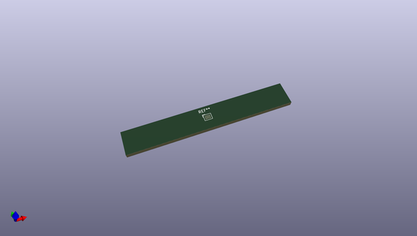
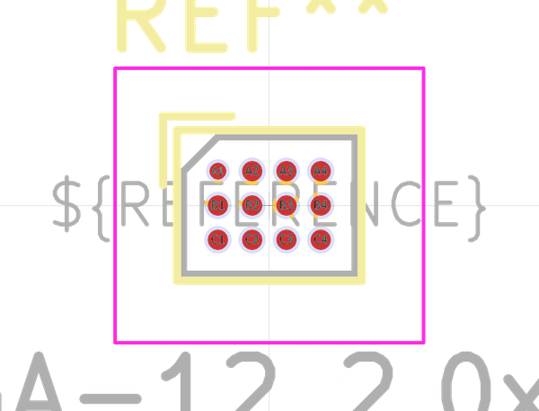
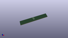

# OOMP Footprint  
## Texas_MicroStar_Junior_BGA-12_2.0x2.5mm_Layout4x3_P0.5mm  by none  
  
oomp key: oomp_kicad_package_bga_texas_microstar_junior_bga_12_2_0x2_5mm_layout4x3_p0_5mm  
  
source repo at: [http://gitlab.com/kicad/kicad-footprints/blob/master/tmp/data//oomlout_oomp_footprint_src/Varistor.pretty/RV_Rect_V25S440P_L26.5mm_W8.2mm_P12.7mm.kicad_mod](http://gitlab.com/kicad/kicad-footprints/blob/master/tmp/data//oomlout_oomp_footprint_src/Varistor.pretty/RV_Rect_V25S440P_L26.5mm_W8.2mm_P12.7mm.kicad_mod)  
## Footprint  
  
  
  
  
| name | value | 
| --- | --- | 
| footprint name | Texas_MicroStar_Junior_BGA-12_2.0x2.5mm_Layout4x3_P0.5mm | 
| footprint description | Texas Instruments, BGA Microstar Junior, 2x2.5mm, 12 bump 4x3 grid, NSMD pad definition (http://www.ti.com/lit/ds/symlink/txb0104.pdf, http://www.ti.com/lit/wp/ssyz015b/ssyz015b.pdf) | 
| number of pads | 12 | 
| github path | http://github.com/kicad/kicad-footprints/blob/master/tmp/data//oomlout_oomp_footprint_src/Package_BGA.pretty/Texas_MicroStar_Junior_BGA-12_2.0x2.5mm_Layout4x3_P0.5mm.kicad_mod | 
| oomp key | oomp_kicad_package_bga_texas_microstar_junior_bga_12_2_0x2_5mm_layout4x3_p0_5mm | 
| oomp bot github | https://github.com/oomlout/oomlout_oomp_footprint_bot/tree/main/tmp/data//oomlout_oomp_footprint_src/footprints/kicad_package_bga_texas_microstar_junior_bga_12_2_0x2_5mm_layout4x3_p0_5mm/working | 
## Images  
  
  
  
  
  
  
  
  
