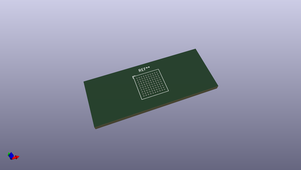
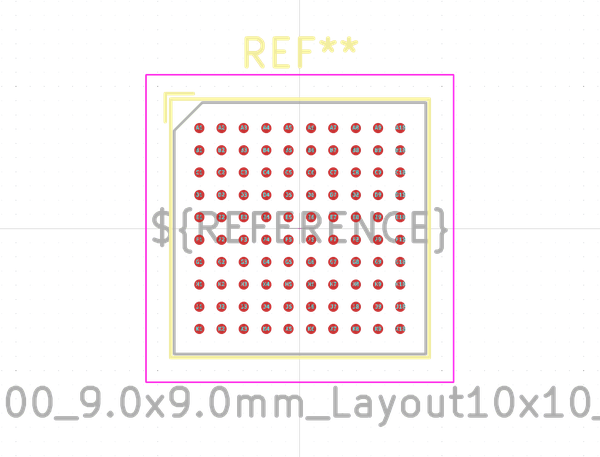
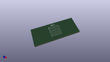
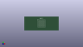

# OOMP Footprint  
## TFBGA-100_9.0x9.0mm_Layout10x10_P0.8mm  by none  
  
oomp key: oomp_kicad_package_bga_tfbga_100_9_0x9_0mm_layout10x10_p0_8mm  
  
source repo at: [http://gitlab.com/kicad/kicad-footprints/blob/master/tmp/data//oomlout_oomp_footprint_src/Varistor.pretty/RV_Rect_V25S440P_L26.5mm_W8.2mm_P12.7mm.kicad_mod](http://gitlab.com/kicad/kicad-footprints/blob/master/tmp/data//oomlout_oomp_footprint_src/Varistor.pretty/RV_Rect_V25S440P_L26.5mm_W8.2mm_P12.7mm.kicad_mod)  
## Footprint  
  
  
  
  
| name | value | 
| --- | --- | 
| footprint name | TFBGA-100_9.0x9.0mm_Layout10x10_P0.8mm | 
| footprint description | TFBGA-100, 10x10, 9x9mm package, pitch 0.8mm | 
| number of pads | 100 | 
| github path | http://github.com/kicad/kicad-footprints/blob/master/tmp/data//oomlout_oomp_footprint_src/Package_BGA.pretty/TFBGA-100_9.0x9.0mm_Layout10x10_P0.8mm.kicad_mod | 
| oomp key | oomp_kicad_package_bga_tfbga_100_9_0x9_0mm_layout10x10_p0_8mm | 
| oomp bot github | https://github.com/oomlout/oomlout_oomp_footprint_bot/tree/main/tmp/data//oomlout_oomp_footprint_src/footprints/kicad_package_bga_tfbga_100_9_0x9_0mm_layout10x10_p0_8mm/working | 
## Images  
  
  
  
  
  
  
  
  
