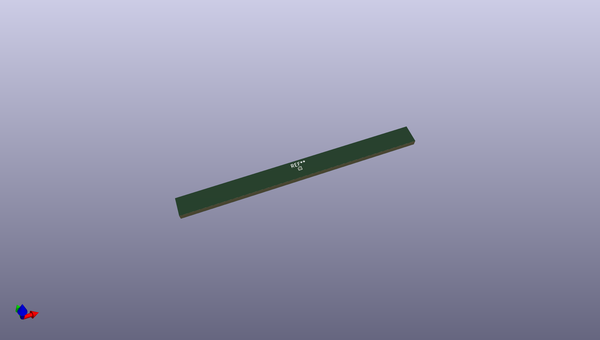
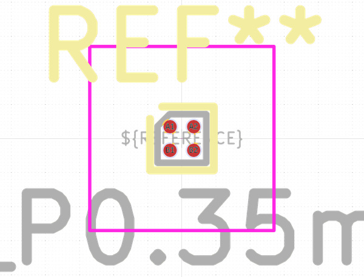
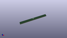

# OOMP Footprint  
## WLP-4_0.73x0.73mm_Layout2x2_P0.35mm_Ball0.22mm_Pad0.2mm_NSMD  by none  
  
oomp key: oomp_kicad_package_bga_wlp_4_0_73x0_73mm_layout2x2_p0_35mm_ball0_22mm_pad0_2mm_nsmd  
  
source repo at: [http://gitlab.com/kicad/kicad-footprints/blob/master/tmp/data//oomlout_oomp_footprint_src/Varistor.pretty/RV_Rect_V25S440P_L26.5mm_W8.2mm_P12.7mm.kicad_mod](http://gitlab.com/kicad/kicad-footprints/blob/master/tmp/data//oomlout_oomp_footprint_src/Varistor.pretty/RV_Rect_V25S440P_L26.5mm_W8.2mm_P12.7mm.kicad_mod)  
## Footprint  
  
  
  
  
| name | value | 
| --- | --- | 
| footprint name | WLP-4_0.73x0.73mm_Layout2x2_P0.35mm_Ball0.22mm_Pad0.2mm_NSMD | 
| footprint description | WLP-4, 2x2 raster, 0.73x0.73mm package, pitch 0.35mm; https://datasheets.maximintegrated.com/en/ds/MAX40200.pdf | 
| number of pads | 4 | 
| github path | http://github.com/kicad/kicad-footprints/blob/master/tmp/data//oomlout_oomp_footprint_src/Package_BGA.pretty/WLP-4_0.73x0.73mm_Layout2x2_P0.35mm_Ball0.22mm_Pad0.2mm_NSMD.kicad_mod | 
| oomp key | oomp_kicad_package_bga_wlp_4_0_73x0_73mm_layout2x2_p0_35mm_ball0_22mm_pad0_2mm_nsmd | 
| oomp bot github | https://github.com/oomlout/oomlout_oomp_footprint_bot/tree/main/tmp/data//oomlout_oomp_footprint_src/footprints/kicad_package_bga_wlp_4_0_73x0_73mm_layout2x2_p0_35mm_ball0_22mm_pad0_2mm_nsmd/working | 
## Images  
  
  
  
  
  
  
  
  
