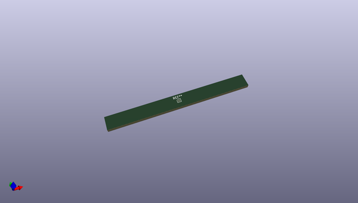
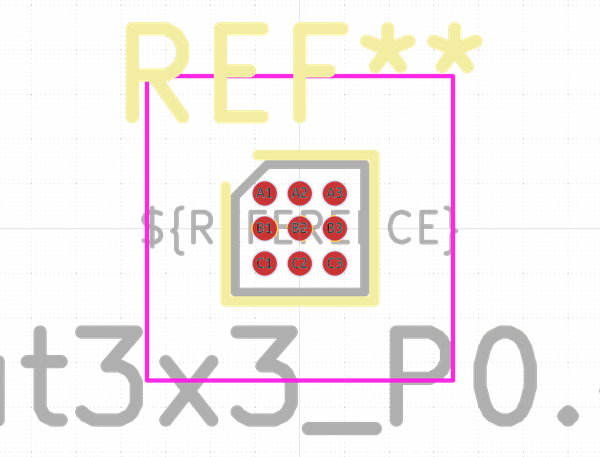
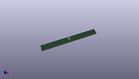

# OOMP Footprint  
## WLP-9_1.448x1.468mm_Layout3x3_P0.4mm_Ball0.27mm_Pad0.25mm  by none  
  
oomp key: oomp_kicad_package_bga_wlp_9_1_448x1_468mm_layout3x3_p0_4mm_ball0_27mm_pad0_25mm  
  
source repo at: [http://gitlab.com/kicad/kicad-footprints/blob/master/tmp/data//oomlout_oomp_footprint_src/Varistor.pretty/RV_Rect_V25S440P_L26.5mm_W8.2mm_P12.7mm.kicad_mod](http://gitlab.com/kicad/kicad-footprints/blob/master/tmp/data//oomlout_oomp_footprint_src/Varistor.pretty/RV_Rect_V25S440P_L26.5mm_W8.2mm_P12.7mm.kicad_mod)  
## Footprint  
  
  
  
  
| name | value | 
| --- | --- | 
| footprint name | WLP-9_1.448x1.468mm_Layout3x3_P0.4mm_Ball0.27mm_Pad0.25mm | 
| footprint description | WLP-9, 1.448x1.468mm, 9 Ball, 3x3 Layout, 0.4mm Pitch, https://pdfserv.maximintegrated.com/package_dwgs/21-100168.PDF | 
| number of pads | 9 | 
| github path | http://github.com/kicad/kicad-footprints/blob/master/tmp/data//oomlout_oomp_footprint_src/Package_BGA.pretty/WLP-9_1.448x1.468mm_Layout3x3_P0.4mm_Ball0.27mm_Pad0.25mm.kicad_mod | 
| oomp key | oomp_kicad_package_bga_wlp_9_1_448x1_468mm_layout3x3_p0_4mm_ball0_27mm_pad0_25mm | 
| oomp bot github | https://github.com/oomlout/oomlout_oomp_footprint_bot/tree/main/tmp/data//oomlout_oomp_footprint_src/footprints/kicad_package_bga_wlp_9_1_448x1_468mm_layout3x3_p0_4mm_ball0_27mm_pad0_25mm/working | 
## Images  
  
  
  
  
  
  
  
  
