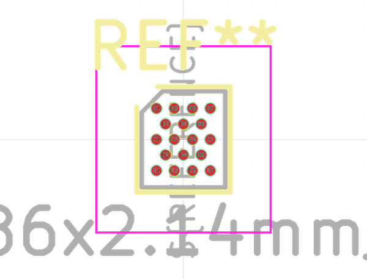
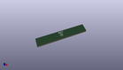

# OOMP Footprint  
## ST_WLCSP-18_1.86x2.14mm_P0.4mm_Stagger  by none  
  
oomp key: oomp_kicad_package_csp_st_wlcsp_18_1_86x2_14mm_p0_4mm_stagger  
  
source repo at: [http://gitlab.com/kicad/kicad-footprints/blob/master/tmp/data//oomlout_oomp_footprint_src/Varistor.pretty/RV_Rect_V25S440P_L26.5mm_W8.2mm_P12.7mm.kicad_mod](http://gitlab.com/kicad/kicad-footprints/blob/master/tmp/data//oomlout_oomp_footprint_src/Varistor.pretty/RV_Rect_V25S440P_L26.5mm_W8.2mm_P12.7mm.kicad_mod)  
## Footprint  
  
  
  
  
| name | value | 
| --- | --- | 
| footprint name | ST_WLCSP-18_1.86x2.14mm_P0.4mm_Stagger | 
| footprint description | ST WLCSP-18, ST Die ID 466, 1.86x2.14mm, 18 Ball, X-staggered 7x5 Layout, 0.4mm Pitch, https://www.st.com/resource/en/datasheet/stm32g031y8.pdf | 
| number of pads | 18 | 
| github path | http://github.com/kicad/kicad-footprints/blob/master/tmp/data//oomlout_oomp_footprint_src/Package_CSP.pretty/ST_WLCSP-18_1.86x2.14mm_P0.4mm_Stagger.kicad_mod | 
| oomp key | oomp_kicad_package_csp_st_wlcsp_18_1_86x2_14mm_p0_4mm_stagger | 
| oomp bot github | https://github.com/oomlout/oomlout_oomp_footprint_bot/tree/main/tmp/data//oomlout_oomp_footprint_src/footprints/kicad_package_csp_st_wlcsp_18_1_86x2_14mm_p0_4mm_stagger/working | 
## Images  
  
  
  
  
  
  
  
  
