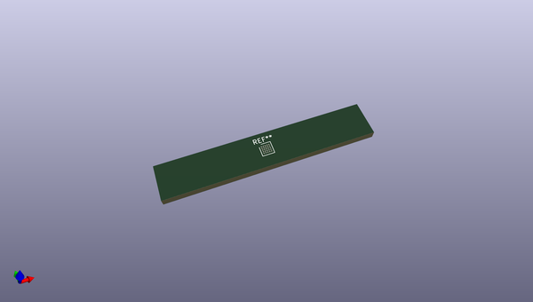
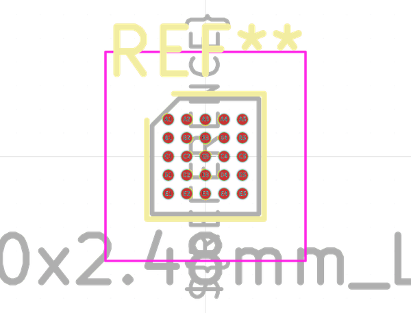
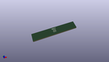

# OOMP Footprint  
## ST_WLCSP-25_2.30x2.48mm_Layout5x5_P0.4mm  by none  
  
oomp key: oomp_kicad_package_csp_st_wlcsp_25_2_30x2_48mm_layout5x5_p0_4mm  
  
source repo at: [http://gitlab.com/kicad/kicad-footprints/blob/master/tmp/data//oomlout_oomp_footprint_src/Varistor.pretty/RV_Rect_V25S440P_L26.5mm_W8.2mm_P12.7mm.kicad_mod](http://gitlab.com/kicad/kicad-footprints/blob/master/tmp/data//oomlout_oomp_footprint_src/Varistor.pretty/RV_Rect_V25S440P_L26.5mm_W8.2mm_P12.7mm.kicad_mod)  
## Footprint  
  
  
  
  
| name | value | 
| --- | --- | 
| footprint name | ST_WLCSP-25_2.30x2.48mm_Layout5x5_P0.4mm | 
| footprint description | ST WLCSP-25, ST die ID 460, 2.3x2.48mm, 25 Ball, 5x5 Layout, 0.4mm Pitch, https://www.st.com/resource/en/datasheet/stm32g071eb.pdf | 
| number of pads | 25 | 
| github path | http://github.com/kicad/kicad-footprints/blob/master/tmp/data//oomlout_oomp_footprint_src/Package_CSP.pretty/ST_WLCSP-25_2.30x2.48mm_Layout5x5_P0.4mm.kicad_mod | 
| oomp key | oomp_kicad_package_csp_st_wlcsp_25_2_30x2_48mm_layout5x5_p0_4mm | 
| oomp bot github | https://github.com/oomlout/oomlout_oomp_footprint_bot/tree/main/tmp/data//oomlout_oomp_footprint_src/footprints/kicad_package_csp_st_wlcsp_25_2_30x2_48mm_layout5x5_p0_4mm/working | 
## Images  
  
  
  
  
  
  
  
  
