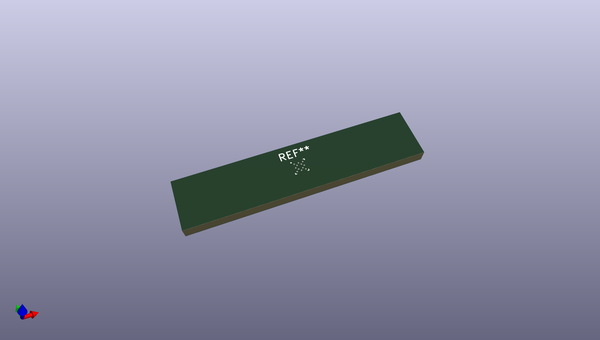
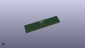

# OOMP Footprint  
## WLCSP-12_1.56x1.56mm_P0.4mm  by none  
  
oomp key: oomp_kicad_package_csp_wlcsp_12_1_56x1_56mm_p0_4mm  
  
source repo at: [http://gitlab.com/kicad/kicad-footprints/blob/master/tmp/data//oomlout_oomp_footprint_src/Varistor.pretty/RV_Rect_V25S440P_L26.5mm_W8.2mm_P12.7mm.kicad_mod](http://gitlab.com/kicad/kicad-footprints/blob/master/tmp/data//oomlout_oomp_footprint_src/Varistor.pretty/RV_Rect_V25S440P_L26.5mm_W8.2mm_P12.7mm.kicad_mod)  
## Footprint  
  
  
  
  
| name | value | 
| --- | --- | 
| footprint name | WLCSP-12_1.56x1.56mm_P0.4mm | 
| footprint description | WLCSP 12 1.56x1.56 https://ae-bst.resource.bosch.com/media/_tech/media/datasheets/BST-BMM150-DS001-01.pdf | 
| number of pads | 12 | 
| github path | http://github.com/kicad/kicad-footprints/blob/master/tmp/data//oomlout_oomp_footprint_src/Package_CSP.pretty/WLCSP-12_1.56x1.56mm_P0.4mm.kicad_mod | 
| oomp key | oomp_kicad_package_csp_wlcsp_12_1_56x1_56mm_p0_4mm | 
| oomp bot github | https://github.com/oomlout/oomlout_oomp_footprint_bot/tree/main/tmp/data//oomlout_oomp_footprint_src/footprints/kicad_package_csp_wlcsp_12_1_56x1_56mm_p0_4mm/working | 
## Images  
  
  
  
  
  
  
  
  
