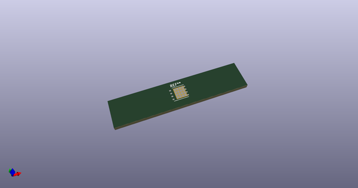
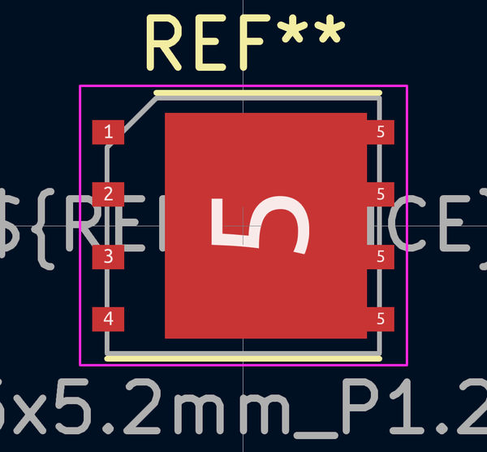

# OOMP Footprint  
## AO_DFN-8-1EP_5.55x5.2mm_P1.27mm_EP4.12x4.6mm  by none  
  
oomp key: oomp_kicad_package_dfn_qfn_ao_dfn_8_1ep_5_55x5_2mm_p1_27mm_ep4_12x4_6mm  
  
source repo at: [http://gitlab.com/kicad/kicad-footprints/blob/master/tmp/data//oomlout_oomp_footprint_src/Varistor.pretty/RV_Rect_V25S440P_L26.5mm_W8.2mm_P12.7mm.kicad_mod](http://gitlab.com/kicad/kicad-footprints/blob/master/tmp/data//oomlout_oomp_footprint_src/Varistor.pretty/RV_Rect_V25S440P_L26.5mm_W8.2mm_P12.7mm.kicad_mod)  
## Footprint  
  
  
  
  
| name | value | 
| --- | --- | 
| footprint name | AO_DFN-8-1EP_5.55x5.2mm_P1.27mm_EP4.12x4.6mm | 
| footprint description | DD Package; 8-Lead Plastic DFN (5.55mm x 5.2mm), Pin 5-8 connected to EP (http://www.aosmd.com/res/packaging_information/DFN5x6_8L_EP1_P.pdf) | 
| number of pads | 25 | 
| github path | http://github.com/kicad/kicad-footprints/blob/master/tmp/data//oomlout_oomp_footprint_src/Package_DFN_QFN.pretty/AO_DFN-8-1EP_5.55x5.2mm_P1.27mm_EP4.12x4.6mm.kicad_mod | 
| oomp key | oomp_kicad_package_dfn_qfn_ao_dfn_8_1ep_5_55x5_2mm_p1_27mm_ep4_12x4_6mm | 
| oomp bot github | https://github.com/oomlout/oomlout_oomp_footprint_bot/tree/main/tmp/data//oomlout_oomp_footprint_src/footprints/kicad_package_dfn_qfn_ao_dfn_8_1ep_5_55x5_2mm_p1_27mm_ep4_12x4_6mm/working | 
## Images  
  
  
  
  
  
  
  
  
