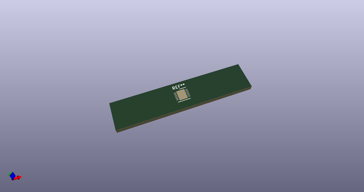
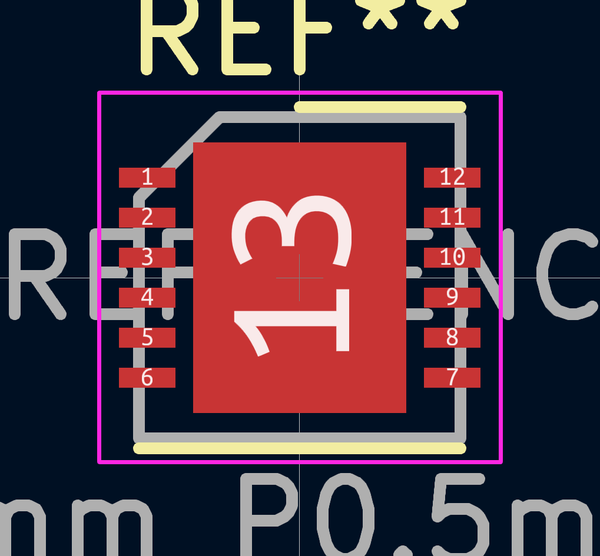
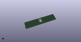

# OOMP Footprint  
## DFN-12-1EP_4x4mm_P0.5mm_EP2.66x3.38mm  by none  
  
oomp key: oomp_kicad_package_dfn_qfn_dfn_12_1ep_4x4mm_p0_5mm_ep2_66x3_38mm  
  
source repo at: [http://gitlab.com/kicad/kicad-footprints/blob/master/tmp/data//oomlout_oomp_footprint_src/Varistor.pretty/RV_Rect_V25S440P_L26.5mm_W8.2mm_P12.7mm.kicad_mod](http://gitlab.com/kicad/kicad-footprints/blob/master/tmp/data//oomlout_oomp_footprint_src/Varistor.pretty/RV_Rect_V25S440P_L26.5mm_W8.2mm_P12.7mm.kicad_mod)  
## Footprint  
  
  
  
  
| name | value | 
| --- | --- | 
| footprint name | DFN-12-1EP_4x4mm_P0.5mm_EP2.66x3.38mm | 
| footprint description | DF Package; 12-Lead Plastic DFN (4mm x 4mm) (see Linear Technology 05081733_A_DF12.pdf) | 
| number of pads | 21 | 
| github path | http://github.com/kicad/kicad-footprints/blob/master/tmp/data//oomlout_oomp_footprint_src/Package_DFN_QFN.pretty/DFN-12-1EP_4x4mm_P0.5mm_EP2.66x3.38mm.kicad_mod | 
| oomp key | oomp_kicad_package_dfn_qfn_dfn_12_1ep_4x4mm_p0_5mm_ep2_66x3_38mm | 
| oomp bot github | https://github.com/oomlout/oomlout_oomp_footprint_bot/tree/main/tmp/data//oomlout_oomp_footprint_src/footprints/kicad_package_dfn_qfn_dfn_12_1ep_4x4mm_p0_5mm_ep2_66x3_38mm/working | 
## Images  
  
  
  
  
  
  
  
  
