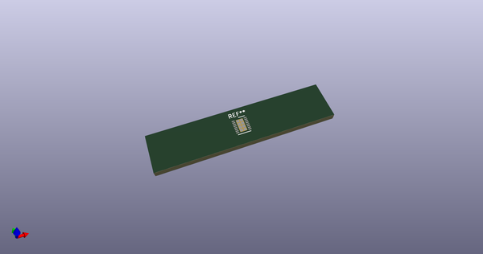
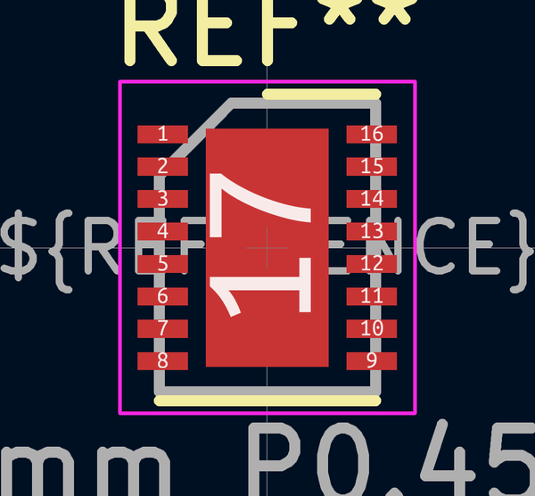

# OOMP Footprint  
## DFN-16-1EP_3x4mm_P0.45mm_EP1.7x3.3mm  by none  
  
oomp key: oomp_kicad_package_dfn_qfn_dfn_16_1ep_3x4mm_p0_45mm_ep1_7x3_3mm  
  
source repo at: [http://gitlab.com/kicad/kicad-footprints/blob/master/tmp/data//oomlout_oomp_footprint_src/Varistor.pretty/RV_Rect_V25S440P_L26.5mm_W8.2mm_P12.7mm.kicad_mod](http://gitlab.com/kicad/kicad-footprints/blob/master/tmp/data//oomlout_oomp_footprint_src/Varistor.pretty/RV_Rect_V25S440P_L26.5mm_W8.2mm_P12.7mm.kicad_mod)  
## Footprint  
  
  
  
  
| name | value | 
| --- | --- | 
| footprint name | DFN-16-1EP_3x4mm_P0.45mm_EP1.7x3.3mm | 
| footprint description | DE Package; 16-Lead Plastic DFN (4mm x 3mm) (see Linear Technology DFN_16_05-08-1732.pdf) | 
| number of pads | 25 | 
| github path | http://github.com/kicad/kicad-footprints/blob/master/tmp/data//oomlout_oomp_footprint_src/Package_DFN_QFN.pretty/DFN-16-1EP_3x4mm_P0.45mm_EP1.7x3.3mm.kicad_mod | 
| oomp key | oomp_kicad_package_dfn_qfn_dfn_16_1ep_3x4mm_p0_45mm_ep1_7x3_3mm | 
| oomp bot github | https://github.com/oomlout/oomlout_oomp_footprint_bot/tree/main/tmp/data//oomlout_oomp_footprint_src/footprints/kicad_package_dfn_qfn_dfn_16_1ep_3x4mm_p0_45mm_ep1_7x3_3mm/working | 
## Images  
  
  
  
  
  
  
  
  
