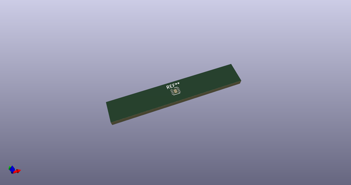
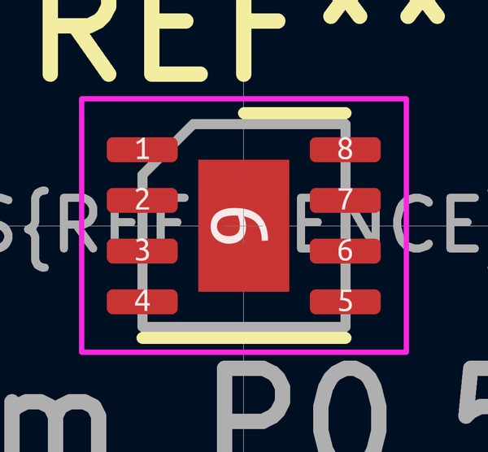
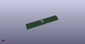

# OOMP Footprint  
## DFN-8-1EP_2x2mm_P0.5mm_EP0.9x1.3mm  by none  
  
oomp key: oomp_kicad_package_dfn_qfn_dfn_8_1ep_2x2mm_p0_5mm_ep0_9x1_3mm  
  
source repo at: [http://gitlab.com/kicad/kicad-footprints/blob/master/tmp/data//oomlout_oomp_footprint_src/Varistor.pretty/RV_Rect_V25S440P_L26.5mm_W8.2mm_P12.7mm.kicad_mod](http://gitlab.com/kicad/kicad-footprints/blob/master/tmp/data//oomlout_oomp_footprint_src/Varistor.pretty/RV_Rect_V25S440P_L26.5mm_W8.2mm_P12.7mm.kicad_mod)  
## Footprint  
  
  
  
  
| name | value | 
| --- | --- | 
| footprint name | DFN-8-1EP_2x2mm_P0.5mm_EP0.9x1.3mm | 
| footprint description | DFN, 8 Pin (https://www.onsemi.com/pub/Collateral/NB3N551-D.PDF#page=7), generated with kicad-footprint-generator ipc_noLead_generator.py | 
| number of pads | 13 | 
| github path | http://github.com/kicad/kicad-footprints/blob/master/tmp/data//oomlout_oomp_footprint_src/Package_DFN_QFN.pretty/DFN-8-1EP_2x2mm_P0.5mm_EP0.9x1.3mm.kicad_mod | 
| oomp key | oomp_kicad_package_dfn_qfn_dfn_8_1ep_2x2mm_p0_5mm_ep0_9x1_3mm | 
| oomp bot github | https://github.com/oomlout/oomlout_oomp_footprint_bot/tree/main/tmp/data//oomlout_oomp_footprint_src/footprints/kicad_package_dfn_qfn_dfn_8_1ep_2x2mm_p0_5mm_ep0_9x1_3mm/working | 
## Images  
  
  
  
  
  
  
  
  
