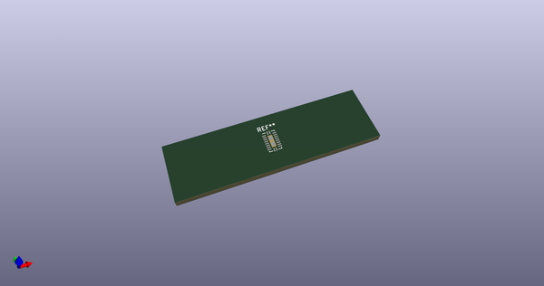
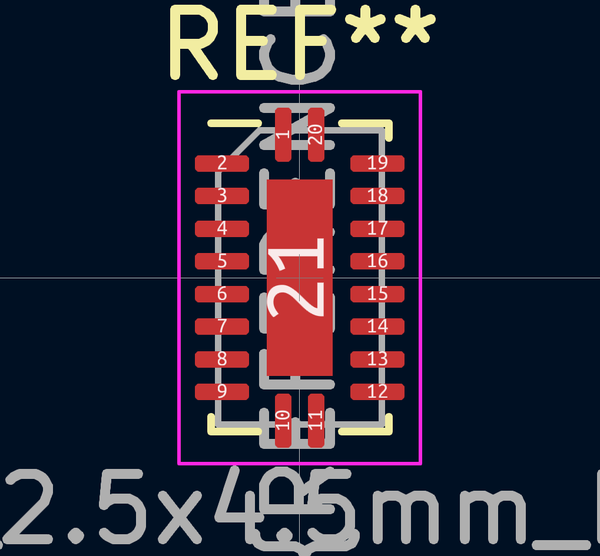
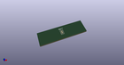

# OOMP Footprint  
## DHVQFN-20-1EP_2.5x4.5mm_P0.5mm_EP1x3mm  by none  
  
oomp key: oomp_kicad_package_dfn_qfn_dhvqfn_20_1ep_2_5x4_5mm_p0_5mm_ep1x3mm  
  
source repo at: [http://gitlab.com/kicad/kicad-footprints/blob/master/tmp/data//oomlout_oomp_footprint_src/Varistor.pretty/RV_Rect_V25S440P_L26.5mm_W8.2mm_P12.7mm.kicad_mod](http://gitlab.com/kicad/kicad-footprints/blob/master/tmp/data//oomlout_oomp_footprint_src/Varistor.pretty/RV_Rect_V25S440P_L26.5mm_W8.2mm_P12.7mm.kicad_mod)  
## Footprint  
  
  
  
  
| name | value | 
| --- | --- | 
| footprint name | DHVQFN-20-1EP_2.5x4.5mm_P0.5mm_EP1x3mm | 
| footprint description | DHVQFN, 20 Pin (JEDEC MO-241/VAC, https://assets.nexperia.com/documents/package-information/SOT764-1.pdf), generated with kicad-footprint-generator ipc_noLead_generator.py | 
| number of pads | 23 | 
| github path | http://github.com/kicad/kicad-footprints/blob/master/tmp/data//oomlout_oomp_footprint_src/Package_DFN_QFN.pretty/DHVQFN-20-1EP_2.5x4.5mm_P0.5mm_EP1x3mm.kicad_mod | 
| oomp key | oomp_kicad_package_dfn_qfn_dhvqfn_20_1ep_2_5x4_5mm_p0_5mm_ep1x3mm | 
| oomp bot github | https://github.com/oomlout/oomlout_oomp_footprint_bot/tree/main/tmp/data//oomlout_oomp_footprint_src/footprints/kicad_package_dfn_qfn_dhvqfn_20_1ep_2_5x4_5mm_p0_5mm_ep1x3mm/working | 
## Images  
  
  
  
  
  
  
  
  
