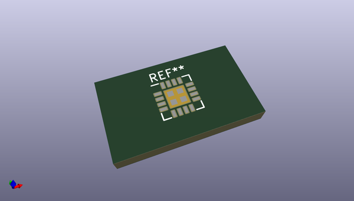
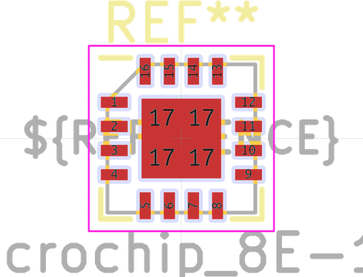
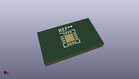
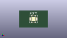

# OOMP Footprint  
## Microchip_8E-16  by none  
  
oomp key: oomp_kicad_package_dfn_qfn_microchip_8e_16  
  
source repo at: [http://gitlab.com/kicad/kicad-footprints/blob/master/tmp/data//oomlout_oomp_footprint_src/Varistor.pretty/RV_Rect_V25S440P_L26.5mm_W8.2mm_P12.7mm.kicad_mod](http://gitlab.com/kicad/kicad-footprints/blob/master/tmp/data//oomlout_oomp_footprint_src/Varistor.pretty/RV_Rect_V25S440P_L26.5mm_W8.2mm_P12.7mm.kicad_mod)  
## Footprint  
  
  
  
  
| name | value | 
| --- | --- | 
| footprint name | Microchip_8E-16 | 
| footprint description | 16-Lead Quad Flat, No Lead Package (8E) - 4x4x0.9 mm Body [UQFN]; (see Microchip Packaging Specification 00000049BS.pdf) | 
| number of pads | 20 | 
| github path | http://github.com/kicad/kicad-footprints/blob/master/tmp/data//oomlout_oomp_footprint_src/Package_DFN_QFN.pretty/Microchip_8E-16.kicad_mod | 
| oomp key | oomp_kicad_package_dfn_qfn_microchip_8e_16 | 
| oomp bot github | https://github.com/oomlout/oomlout_oomp_footprint_bot/tree/main/tmp/data//oomlout_oomp_footprint_src/footprints/kicad_package_dfn_qfn_microchip_8e_16/working | 
## Images  
  
  
  
  
  
  
  
  
