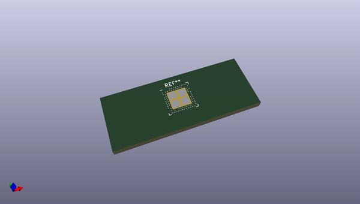
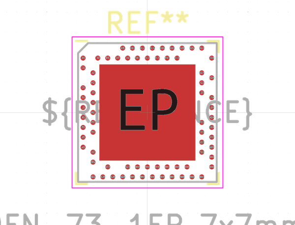
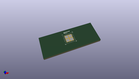
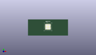

# OOMP Footprint  
## Nordic_AQFN-73-1EP_7x7mm_P0.5mm  by none  
  
oomp key: oomp_kicad_package_dfn_qfn_nordic_aqfn_73_1ep_7x7mm_p0_5mm  
  
source repo at: [http://gitlab.com/kicad/kicad-footprints/blob/master/tmp/data//oomlout_oomp_footprint_src/Varistor.pretty/RV_Rect_V25S440P_L26.5mm_W8.2mm_P12.7mm.kicad_mod](http://gitlab.com/kicad/kicad-footprints/blob/master/tmp/data//oomlout_oomp_footprint_src/Varistor.pretty/RV_Rect_V25S440P_L26.5mm_W8.2mm_P12.7mm.kicad_mod)  
## Footprint  
  
  
  
  
| name | value | 
| --- | --- | 
| footprint name | Nordic_AQFN-73-1EP_7x7mm_P0.5mm | 
| footprint description | http://infocenter.nordicsemi.com/index.jsp?topic=%2Fcom.nordic.infocenter.nrf52%2Fdita%2Fnrf52%2Fchips%2Fnrf52840.html | 
| number of pads | 78 | 
| github path | http://github.com/kicad/kicad-footprints/blob/master/tmp/data//oomlout_oomp_footprint_src/Package_DFN_QFN.pretty/Nordic_AQFN-73-1EP_7x7mm_P0.5mm.kicad_mod | 
| oomp key | oomp_kicad_package_dfn_qfn_nordic_aqfn_73_1ep_7x7mm_p0_5mm | 
| oomp bot github | https://github.com/oomlout/oomlout_oomp_footprint_bot/tree/main/tmp/data//oomlout_oomp_footprint_src/footprints/kicad_package_dfn_qfn_nordic_aqfn_73_1ep_7x7mm_p0_5mm/working | 
## Images  
  
  
  
  
  
  
  
  
