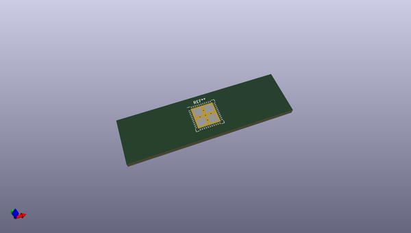
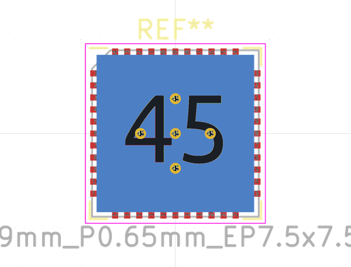
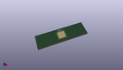

# OOMP Footprint  
## QFN-44-1EP_9x9mm_P0.65mm_EP7.5x7.5mm_ThermalVias  by none  
  
oomp key: oomp_kicad_package_dfn_qfn_qfn_44_1ep_9x9mm_p0_65mm_ep7_5x7_5mm_thermalvias  
  
source repo at: [http://gitlab.com/kicad/kicad-footprints/blob/master/tmp/data//oomlout_oomp_footprint_src/Varistor.pretty/RV_Rect_V25S440P_L26.5mm_W8.2mm_P12.7mm.kicad_mod](http://gitlab.com/kicad/kicad-footprints/blob/master/tmp/data//oomlout_oomp_footprint_src/Varistor.pretty/RV_Rect_V25S440P_L26.5mm_W8.2mm_P12.7mm.kicad_mod)  
## Footprint  
  
  
  
  
| name | value | 
| --- | --- | 
| footprint name | QFN-44-1EP_9x9mm_P0.65mm_EP7.5x7.5mm_ThermalVias | 
| footprint description | 44-Lead Plastic Quad Flat, No Lead Package - 9x9 mm Body [QFN] with thermal vias; see section 10.3 of https://www.parallax.com/sites/default/files/downloads/P8X32A-Propeller-Datasheet-v1.4.0_0.pdf | 
| number of pads | 55 | 
| github path | http://github.com/kicad/kicad-footprints/blob/master/tmp/data//oomlout_oomp_footprint_src/Package_DFN_QFN.pretty/QFN-44-1EP_9x9mm_P0.65mm_EP7.5x7.5mm_ThermalVias.kicad_mod | 
| oomp key | oomp_kicad_package_dfn_qfn_qfn_44_1ep_9x9mm_p0_65mm_ep7_5x7_5mm_thermalvias | 
| oomp bot github | https://github.com/oomlout/oomlout_oomp_footprint_bot/tree/main/tmp/data//oomlout_oomp_footprint_src/footprints/kicad_package_dfn_qfn_qfn_44_1ep_9x9mm_p0_65mm_ep7_5x7_5mm_thermalvias/working | 
## Images  
  
  
  
  
  
  
  
  
