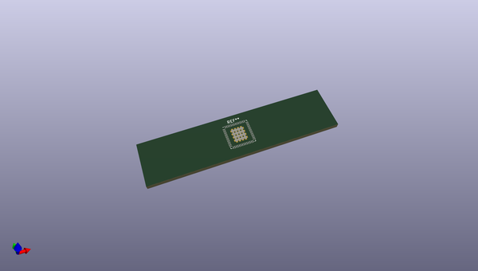
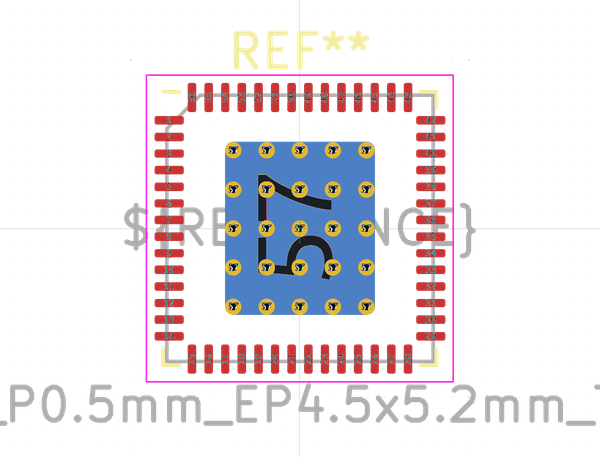
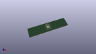

# OOMP Footprint  
## QFN-56-1EP_8x8mm_P0.5mm_EP4.5x5.2mm_ThermalVias_TopTented  by none  
  
oomp key: oomp_kicad_package_dfn_qfn_qfn_56_1ep_8x8mm_p0_5mm_ep4_5x5_2mm_thermalvias_toptented  
  
source repo at: [http://gitlab.com/kicad/kicad-footprints/blob/master/tmp/data//oomlout_oomp_footprint_src/Varistor.pretty/RV_Rect_V25S440P_L26.5mm_W8.2mm_P12.7mm.kicad_mod](http://gitlab.com/kicad/kicad-footprints/blob/master/tmp/data//oomlout_oomp_footprint_src/Varistor.pretty/RV_Rect_V25S440P_L26.5mm_W8.2mm_P12.7mm.kicad_mod)  
## Footprint  
  
  
  
  
| name | value | 
| --- | --- | 
| footprint name | QFN-56-1EP_8x8mm_P0.5mm_EP4.5x5.2mm_ThermalVias_TopTented | 
| footprint description | QFN, 56 Pin top tented version (manually modified). For information see: http://www.cypress.com/file/138911/download | 
| number of pads | 115 | 
| github path | http://github.com/kicad/kicad-footprints/blob/master/tmp/data//oomlout_oomp_footprint_src/Package_DFN_QFN.pretty/QFN-56-1EP_8x8mm_P0.5mm_EP4.5x5.2mm_ThermalVias_TopTented.kicad_mod | 
| oomp key | oomp_kicad_package_dfn_qfn_qfn_56_1ep_8x8mm_p0_5mm_ep4_5x5_2mm_thermalvias_toptented | 
| oomp bot github | https://github.com/oomlout/oomlout_oomp_footprint_bot/tree/main/tmp/data//oomlout_oomp_footprint_src/footprints/kicad_package_dfn_qfn_qfn_56_1ep_8x8mm_p0_5mm_ep4_5x5_2mm_thermalvias_toptented/working | 
## Images  
  
  
  
  
  
  
  
  
