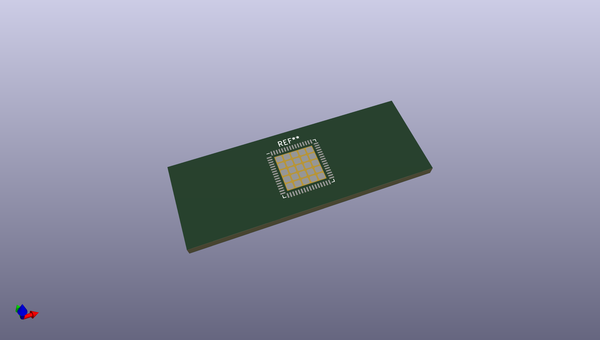
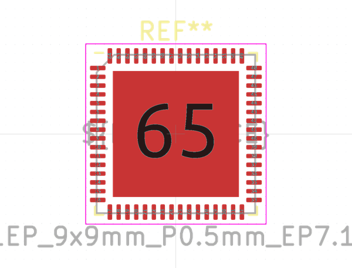
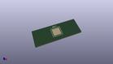

# OOMP Footprint  
## QFN-64-1EP_9x9mm_P0.5mm_EP7.15x7.15mm  by none  
  
oomp key: oomp_kicad_package_dfn_qfn_qfn_64_1ep_9x9mm_p0_5mm_ep7_15x7_15mm  
  
source repo at: [http://gitlab.com/kicad/kicad-footprints/blob/master/tmp/data//oomlout_oomp_footprint_src/Varistor.pretty/RV_Rect_V25S440P_L26.5mm_W8.2mm_P12.7mm.kicad_mod](http://gitlab.com/kicad/kicad-footprints/blob/master/tmp/data//oomlout_oomp_footprint_src/Varistor.pretty/RV_Rect_V25S440P_L26.5mm_W8.2mm_P12.7mm.kicad_mod)  
## Footprint  
  
  
  
  
| name | value | 
| --- | --- | 
| footprint name | QFN-64-1EP_9x9mm_P0.5mm_EP7.15x7.15mm | 
| footprint description | QFN, 64 Pin (https://www.analog.com/media/en/technical-documentation/data-sheets/229321fa.pdf#page=27), generated with kicad-footprint-generator ipc_noLead_generator.py | 
| number of pads | 90 | 
| github path | http://github.com/kicad/kicad-footprints/blob/master/tmp/data//oomlout_oomp_footprint_src/Package_DFN_QFN.pretty/QFN-64-1EP_9x9mm_P0.5mm_EP7.15x7.15mm.kicad_mod | 
| oomp key | oomp_kicad_package_dfn_qfn_qfn_64_1ep_9x9mm_p0_5mm_ep7_15x7_15mm | 
| oomp bot github | https://github.com/oomlout/oomlout_oomp_footprint_bot/tree/main/tmp/data//oomlout_oomp_footprint_src/footprints/kicad_package_dfn_qfn_qfn_64_1ep_9x9mm_p0_5mm_ep7_15x7_15mm/working | 
## Images  
  
  
  
  
  
  
  
  
