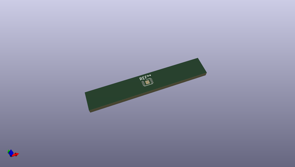
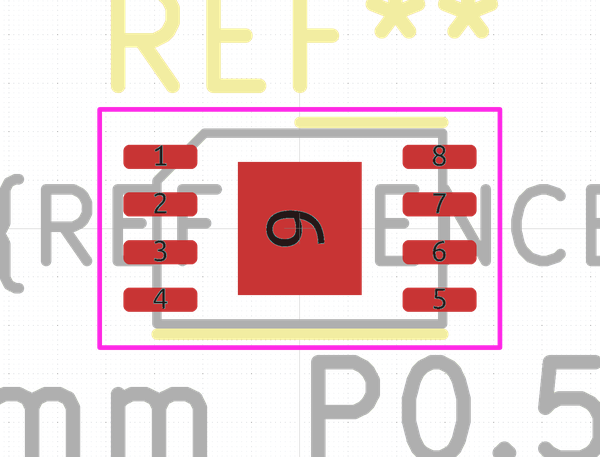
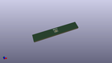

# OOMP Footprint  
## TDFN-8-1EP_3x2mm_P0.5mm_EP1.3x1.4mm  by none  
  
oomp key: oomp_kicad_package_dfn_qfn_tdfn_8_1ep_3x2mm_p0_5mm_ep1_3x1_4mm  
  
source repo at: [http://gitlab.com/kicad/kicad-footprints/blob/master/tmp/data//oomlout_oomp_footprint_src/Varistor.pretty/RV_Rect_V25S440P_L26.5mm_W8.2mm_P12.7mm.kicad_mod](http://gitlab.com/kicad/kicad-footprints/blob/master/tmp/data//oomlout_oomp_footprint_src/Varistor.pretty/RV_Rect_V25S440P_L26.5mm_W8.2mm_P12.7mm.kicad_mod)  
## Footprint  
  
  
  
  
| name | value | 
| --- | --- | 
| footprint name | TDFN-8-1EP_3x2mm_P0.5mm_EP1.3x1.4mm | 
| footprint description | TDFN, 8 Pin (http://ww1.microchip.com/downloads/en/DeviceDoc/MCP6V66-Family-Data-Sheet-DS20006266A.pdf#page=35), generated with kicad-footprint-generator ipc_noLead_generator.py | 
| number of pads | 13 | 
| github path | http://github.com/kicad/kicad-footprints/blob/master/tmp/data//oomlout_oomp_footprint_src/Package_DFN_QFN.pretty/TDFN-8-1EP_3x2mm_P0.5mm_EP1.3x1.4mm.kicad_mod | 
| oomp key | oomp_kicad_package_dfn_qfn_tdfn_8_1ep_3x2mm_p0_5mm_ep1_3x1_4mm | 
| oomp bot github | https://github.com/oomlout/oomlout_oomp_footprint_bot/tree/main/tmp/data//oomlout_oomp_footprint_src/footprints/kicad_package_dfn_qfn_tdfn_8_1ep_3x2mm_p0_5mm_ep1_3x1_4mm/working | 
## Images  
  
  
  
  
  
  
  
  
