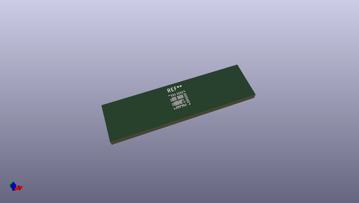
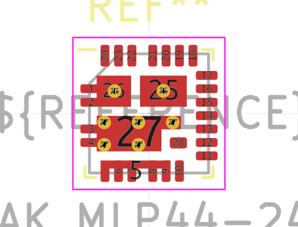
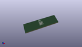

# OOMP Footprint  
## Vishay_PowerPAK_MLP44-24L_ThermalVias  by none  
  
oomp key: oomp_kicad_package_dfn_qfn_vishay_powerpak_mlp44_24l_thermalvias  
  
source repo at: [http://gitlab.com/kicad/kicad-footprints/blob/master/tmp/data//oomlout_oomp_footprint_src/Varistor.pretty/RV_Rect_V25S440P_L26.5mm_W8.2mm_P12.7mm.kicad_mod](http://gitlab.com/kicad/kicad-footprints/blob/master/tmp/data//oomlout_oomp_footprint_src/Varistor.pretty/RV_Rect_V25S440P_L26.5mm_W8.2mm_P12.7mm.kicad_mod)  
## Footprint  
  
  
  
  
| name | value | 
| --- | --- | 
| footprint name | Vishay_PowerPAK_MLP44-24L_ThermalVias | 
| footprint description | PowerPAK PowerPAK MLP44-24L (https://www.vishay.com/docs/78231/mlp44-24l.pdf) | 
| number of pads | 35 | 
| github path | http://github.com/kicad/kicad-footprints/blob/master/tmp/data//oomlout_oomp_footprint_src/Package_DFN_QFN.pretty/Vishay_PowerPAK_MLP44-24L_ThermalVias.kicad_mod | 
| oomp key | oomp_kicad_package_dfn_qfn_vishay_powerpak_mlp44_24l_thermalvias | 
| oomp bot github | https://github.com/oomlout/oomlout_oomp_footprint_bot/tree/main/tmp/data//oomlout_oomp_footprint_src/footprints/kicad_package_dfn_qfn_vishay_powerpak_mlp44_24l_thermalvias/working | 
## Images  
  
  
  
  
  
  
  
  
